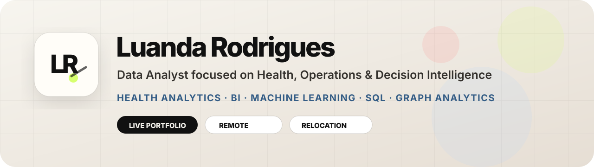

<div align="center">



<br />

<a href="./README.md"><strong>English</strong></a> · <a href="./README.pt-BR.md">Português</a>

<br /><br />


<br />

<a href="https://luandarodrigues.github.io/luandarodrigues/">
  
</a>
<a href="https://cinegraph-network-intelligence-lcsr.streamlit.app/">
  
</a>
<a href="https://www.linkedin.com/in/luanda-rodrigues">
  
</a>
<a href="mailto:luandarodrigues30@gmail.com">
  
</a>

<br /><br />

<strong>Brazilian professional · Available for remote roles · Open to relocation</strong>

</div>

---

## Profile hub

This repository is my **public profile hub**. It centralizes my portfolio, project repositories and applied analytics work across healthcare, operations, business intelligence, machine learning, customer experience and decision intelligence.

I build analytical projects that connect **business context, data quality, modeling, visualization and decision-making**. My background combines Biomedical Engineering, Hospital Management, clinical pharmacy operations, KPI monitoring, public health datasets, digital projects and AI-supported workflows.

---

## Featured projects

| Project | Focus | Status |
|---|---|---|
| [UBS + IBGE + APS Territorial Intelligence](https://github.com/luandarodrigues/ubs-aps-territorial-intelligence) | Health analytics, territorial intelligence, public health BI | [Dashboard live](https://luandarodrigues.github.io/luandarodrigues/dashboards/ubs-healthcare-mapping/?v=aps2) |
| [CineGraph Network Intelligence](https://github.com/luandarodrigues/cinegraph-network-intelligence) | Graph analytics, neural search, hybrid recommender systems, NLP | [Preview app](https://cinegraph-network-intelligence-lcsr.streamlit.app/) |
| [Brazilian E-Commerce Delivery Experience](https://github.com/luandarodrigues/olist-delivery-experience-analytics) | SQL, logistics analytics, customer satisfaction, delivery risk | [Dashboard live](https://luandarodrigues.github.io/olist-delivery-experience-analytics/?v=4) |
| [Heart Disease Risk Prediction](https://github.com/luandarodrigues/heart-disease-risk-prediction) | Clinical machine learning, model evaluation, responsible ML | [Dashboard live](https://luandarodrigues.github.io/heart-disease-risk-prediction/?v=5) |

---

## CineGraph preview roadmap

The **CineGraph AI Explorer** is published as a preview. Next improvements documented in the project repository include persistent embeddings, FAISS retrieval, Node2Vec/GraphSAGE, RAG Q&A, richer poster/title detail pages, stronger caching and a precomputed processed catalog layer.

---

## Technical toolkit

```text
Data Analysis      Python · Pandas · NumPy · Excel · exploratory analysis
BI & Dashboards    Power BI · Looker · KPI monitoring · executive reporting
ML & Modeling      Scikit-learn · classification · model evaluation · ROC-AUC · F1-score
Graph Analytics    NetworkX · edge lists · relationship coverage · recommender graphs
Neural Search      Sentence Transformers · semantic search · FAISS-ready retrieval
NLP                TF-IDF · review mining · sentiment signals · text feature extraction
Databases          SQL · SQLite-ready queries · analytical marts · structured data modeling
Healthcare         Hospital operations · pharmacy workflows · public health datasets
Operations         Bottlenecks · Lean Six Sigma · workflow optimization · decision support
CX Analytics       Reviews · delivery risk · customer dissatisfaction · marketplace operations
```

---

## Background

- **Hospital Management** — UNAMA
- **Biomedical Engineering** — Universidade Federal do Pará
- **Aspire Leadership Program** — Aspire Institute
- Healthcare operations, clinical pharmacy workflows and health data analysis
- Marketing and scientific communication projects involving content creation, HTML email marketing, design, automation and AI-supported workflows

---

<div align="center">

### Portfolio

<a href="https://luandarodrigues.github.io/luandarodrigues/">
  
</a>

<br /><br />

· [LinkedIn](https://www.linkedin.com/in/luanda-rodrigues) · [Behance](https://www.behance.net/luandarodrguez) · [Email](mailto:luandarodrigues30@gmail.com) ·

</div>
