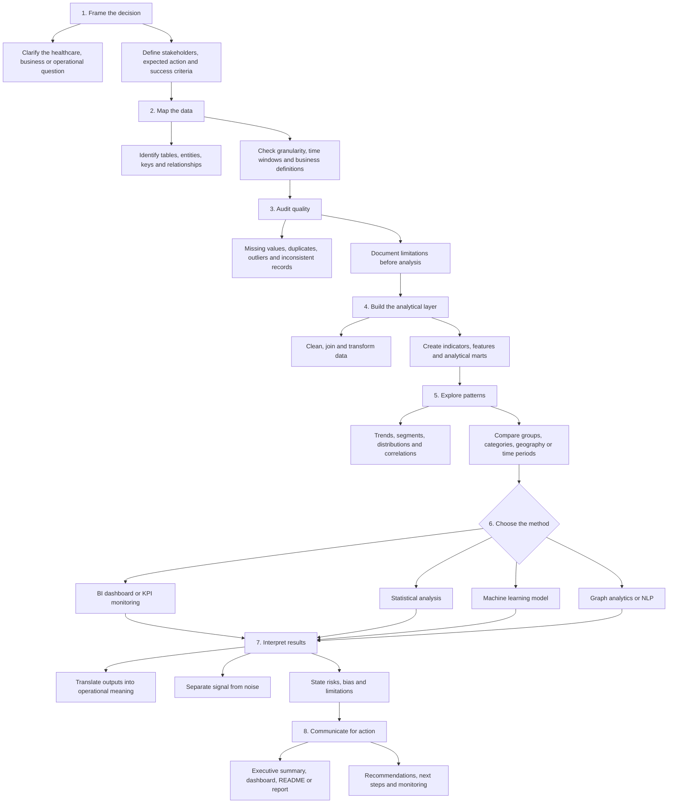

<div align="center">

<picture>
  <source media="(prefers-color-scheme: dark)" srcset="./docs/assets/readme-header-dark.svg" />
  
</picture>

<br />

<a href="./README.md"><strong>English</strong></a> · <a href="./README.pt-BR.md">Português</a>

<br /><br />


<br />

<a href="https://luandarodrigues-portfolio.vercel.app/">
  
</a>
<a href="https://who-global-health-signals.vercel.app/">
  
</a>
<a href="https://www.linkedin.com/in/luanda-rodrigues">
  
</a>
<a href="mailto:luandarodrigues30@gmail.com">
  
</a>

<br /><br />

<strong>Brazilian professional · Available for remote roles · Open to relocation</strong>

</div>

---

## About

I build analytical products that connect **healthcare operations, public data, BI, machine learning and decision communication**.

My background combines **Biomedical Engineering, Hospital Management, clinical pharmacy routines, KPI monitoring, public health datasets and AI-supported workflows**. I approach data as an operational system: understand the question, audit the inputs, model the signal, expose the limits and turn the result into action.

My current portfolio is organized around five complementary layers:

| Layer | Focus |
|---|---|
| **Health analytics** | Public health indicators, healthcare infrastructure, hospital flows and service performance |
| **Decision intelligence** | KPI design, executive reporting, dashboards and decision framing |
| **Machine learning** | Predictive models, validation, benchmark comparison and responsible interpretation |
| **Graphs + NLP** | Network relationships, recommendation logic, TF-IDF and text signals |
| **Operations analytics** | Bottlenecks, logistics, customer experience and workflow optimization |

---

## Flagship Product

### WHO Global Health Signals

**Question:** can public health indicators explain and predict life expectancy differences across countries?

This project rebuilt WHO public indicators into a country-year analytical panel, audited data quality upstream, benchmarked heavy local models against TabPFN, analyzed residuals and published the result as an executive interactive report.

**Final result**

- `13,785` analytical rows
- `218` countries and entities
- `0.110` MAE with `TabPFN`
- `0.243` MAE for the best fully local model

**Why it matters**

The project shows that public health indicators explain life expectancy differences unusually well, while residual analysis still highlights where deeper country context matters. It is both a machine learning benchmark and a decision-intelligence product.

**Open it**

- [Live report](https://who-global-health-signals.vercel.app/)
- [Repository](https://github.com/luandarodrigues/who-global-health-signals)

---

## Selected Archive

| Project | Focus | Snapshot |
|---|---|---|
| [Mapping Primary Healthcare Units in Brazil](./projects/ubs-healthcare-mapping) | Health analytics · Geomapping · Data quality | `47,714` facilities across Brazil with coverage and coordinate-quality analysis |
| [Heart Disease Risk Prediction](./projects/heart-disease-risk-ml) | Machine learning · Clinical risk | `918` clinical records and responsible model evaluation |
| [Brazilian E-Commerce Delivery Experience](./projects/olist-ecommerce-experience-analytics) | SQL · Logistics · Customer experience | `99,441` orders connecting delays, freight and reviews |
| [CineGraph Network Intelligence](./projects/cinegraph-network-intelligence) | Graph analytics · NLP · Recommenders | Media graph analysis with relationship integrity and recommendation logic |

---

## Technical Toolkit

```text
Analytical design  Decision framing · metric logic · executive summaries · reporting
Data foundation    Quality audits · temporal splits · missingness · consistency checks
Modeling           Scikit-learn · benchmark comparison · residual analysis · validation
Data stack         Python · Pandas · NumPy · SQL · analytical marts
Decision BI        Power BI · Looker · KPI design · operational dashboards
Graphs & NLP       NetworkX · TF-IDF · relationship modeling · review mining
Healthcare         Clinical pharmacy · hospital operations · public health datasets
Product delivery   README strategy · live reports · narrative analytics · stakeholder clarity
```

---

## Applied Work

Some applied work cannot be shared publicly because it involves institutional or private-company data. I present those cases through anonymized descriptions and transferable capabilities.

| Project | Context | Skills demonstrated |
|---|---|---|
| **Clinical Pharmacy KPI Dashboard** | Confidential - EBSERH / HC-UFU | KPI design, hospital workflow analysis, operational monitoring, decision support |
| **AI for Scientific Communication in Healthcare** | Confidential - private healthcare companies | Applied AI, automation, health communication, content strategy, low-code workflows |
| **Performance Dashboard for Decision-Making** | Confidential - corporate context | BI structure, executive reporting, dashboard design, business analysis |

---

## Background

- **Hospital Management** - UNAMA
- **Biomedical Engineering** - Federal University of Pará
- **Aspire Leadership Program** - Aspire Institute
- Healthcare operations, clinical pharmacy workflows and public health data analysis
- Marketing technology and scientific communication projects involving HTML email, content, design, automation and AI-supported workflows

---

## How I approach data products

I treat data projects as decision systems. The goal is not only to produce charts or models, but to understand the operational question, test the reliability of the data, choose the right analytical method and communicate conclusions with explicit limits.



---

<div align="center">

### Portfolio

<a href="https://luandarodrigues-portfolio.vercel.app/">
  
</a>

<br /><br />

· [LinkedIn](https://www.linkedin.com/in/luanda-rodrigues) · [WHO live report](https://who-global-health-signals.vercel.app/) · [Email](mailto:luandarodrigues30@gmail.com) ·

</div>
