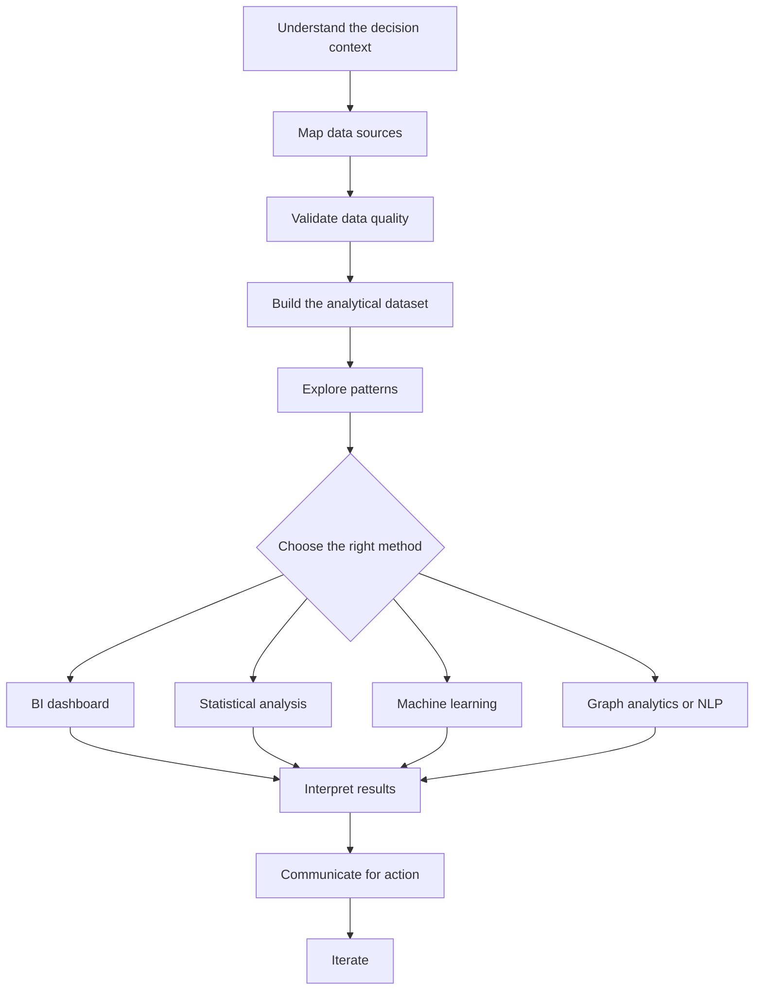

<div align="center">


<br />

<a href="./README.md"><strong>English</strong></a> · <a href="./README.pt-BR.md">Português</a>

<br /><br />


<br />

<a href="https://luandarodrigues.github.io/luandarodrigues/">
  
</a>
<a href="https://github.com/luandarodrigues/ubs-aps-territorial-intelligence">
  
</a>
<a href="https://www.linkedin.com/in/luanda-rodrigues">
  
</a>
<a href="mailto:luandarodrigues30@gmail.com">
  
</a>

<br /><br />

<strong>Brazilian professional · Available for remote roles · Open to relocation</strong>

</div>

---

## Profile hub

This repository is now a **profile hub**. It keeps the public GitHub profile, visual assets and links to the project repositories. The main projects are separated into their own repositories so recruiters and reviewers can inspect each case with a clearer structure.

I build analytical projects that connect **healthcare operations, business intelligence, machine learning, data quality and decision intelligence**. My background combines Biomedical Engineering, Hospital Management, clinical pharmacy operations, KPI monitoring, public health datasets, digital projects and AI-supported workflows.

<table>
  <tr>
    <td><strong>Health Analytics</strong></td>
    <td>Public health datasets, hospital workflows, clinical pharmacy indicators and service performance.</td>
  </tr>
  <tr>
    <td><strong>Business Intelligence</strong></td>
    <td>KPI design, dashboards, executive reporting and operational monitoring.</td>
  </tr>
  <tr>
    <td><strong>Machine Learning</strong></td>
    <td>Classification models, model evaluation, clinical risk and business risk analysis.</td>
  </tr>
  <tr>
    <td><strong>Graph + NLP</strong></td>
    <td>NetworkX, recommendation networks, relationship modeling, TF-IDF and review text mining.</td>
  </tr>
  <tr>
    <td><strong>Operations Analytics</strong></td>
    <td>Bottleneck detection, workflow optimization, logistics performance and customer experience.</td>
  </tr>
</table>

---

## Main project repository

<table>
  <tr>
    <td width="45%" valign="top">
      <h3>UBS + IBGE + Cobertura Potencial APS</h3>
      <p><strong>Health Analytics · Territorial Intelligence · Public Health BI · Data Quality</strong></p>
      <p>Interactive public health analytics project integrating the Brazilian UBS registry with IBGE/SIDRA territorial indicators and APS potential coverage data.</p>
      <p>The project moves beyond counting healthcare units. It compares physical network presence, population pressure, territorial dispersion, coordinate quality and installed primary care capacity.</p>
      <p>
        
        
        
        
      </p>
      <p>
        <a href="https://github.com/luandarodrigues/ubs-aps-territorial-intelligence"><strong>Open repository →</strong></a><br />
        <a href="https://luandarodrigues.github.io/luandarodrigues/dashboards/ubs-healthcare-mapping/?v=aps2"><strong>Open dashboard →</strong></a>
      </p>
    </td>
    <td width="55%" valign="top">
      <h4>What this project demonstrates</h4>
      <ul>
        <li>Data cleaning and normalization of public health datasets.</li>
        <li>Integration between UBS, IBGE/SIDRA and APS coverage data.</li>
        <li>Dashboard-oriented analytical modeling.</li>
        <li>Territorial indicators for health planning.</li>
        <li>Clear analytical limitations and responsible interpretation.</li>
      </ul>
    </td>
  </tr>
</table>

---

## Project repositories

<table>
  <tr>
    <th align="left">Repository</th>
    <th align="left">Focus</th>
    <th align="left">Status</th>
  </tr>
  <tr>
    <td><a href="https://github.com/luandarodrigues/ubs-aps-territorial-intelligence"><strong>UBS + IBGE + APS Territorial Intelligence</strong></a></td>
    <td>Health analytics, territorial intelligence, public health BI</td>
    <td>Published</td>
  </tr>
  <tr>
    <td><a href="https://github.com/luandarodrigues/heart-disease-risk-prediction"><strong>Heart Disease Risk Prediction</strong></a></td>
    <td>Clinical machine learning, model evaluation, responsible ML</td>
    <td>Repository created; README and sheets will be refined next</td>
  </tr>
  <tr>
    <td><a href="https://github.com/luandarodrigues/olist-delivery-experience-analytics"><strong>Brazilian E-Commerce Delivery Experience</strong></a></td>
    <td>SQL, logistics analytics, customer satisfaction, delivery risk</td>
    <td>Repository created; README and sheets will be refined next</td>
  </tr>
  <tr>
    <td><a href="https://github.com/luandarodrigues/cinegraph-network-intelligence"><strong>CineGraph Network Intelligence</strong></a></td>
    <td>Graph analytics, recommender systems, NLP, media data</td>
    <td>Repository created; README and sheets will be refined next</td>
  </tr>
</table>

---

## Technical toolkit

<div align="center">


<br /><br />


</div>

```text
Data Analysis      Python · Pandas · NumPy · Excel · exploratory analysis
BI & Dashboards    Power BI · Looker · KPI monitoring · executive reporting
ML & Modeling      Scikit-learn · classification · model evaluation · ROC-AUC · F1-score
Graph Analytics    NetworkX · edge lists · relationship coverage · recommender graphs
NLP                TF-IDF · review mining · sentiment signals · text feature extraction
Databases          SQL · SQLite-ready queries · analytical marts · structured data modeling
Healthcare         Hospital operations · pharmacy workflows · public health datasets
Operations         Bottlenecks · Lean Six Sigma · workflow optimization · decision support
Automation         AI tools · low-code workflows · health communication projects
```

---

## Applied and confidential work

Some applied work cannot be publicly shared because it involves institutional or private company data. I present these projects through anonymized descriptions and transferable skills.

| Project | Context | Skills demonstrated |
|---|---|---|
| **Clinical Pharmacy KPI Dashboard** | Confidential — EBSERH / HC-UFU | KPI design, hospital workflow analysis, operational monitoring, decision support |
| **AI for Scientific Communication in Healthcare** | Confidential — private healthcare companies | Applied AI, automation, health communication, content strategy, low-code workflows |
| **Performance Dashboard for Decision-Making** | Confidential — corporate context | BI structure, executive reporting, dashboard design, business analysis |

---

## Background

- **Hospital Management** — UNAMA
- **Biomedical Engineering** — Universidade Federal do Pará
- **Aspire Leadership Program** — Aspire Institute
- Healthcare operations, clinical pharmacy workflows and health data analysis
- Marketing and scientific communication projects involving content creation, HTML email marketing, design, automation and AI-supported workflows

---

## How I approach data projects



---

<div align="center">

### Portfolio

<a href="https://luandarodrigues.github.io/luandarodrigues/">
  
</a>

<br /><br />

· [LinkedIn](https://www.linkedin.com/in/luanda-rodrigues) · [Behance](https://www.behance.net/luandarodrguez) · [Email](mailto:luandarodrigues30@gmail.com) ·

</div>
