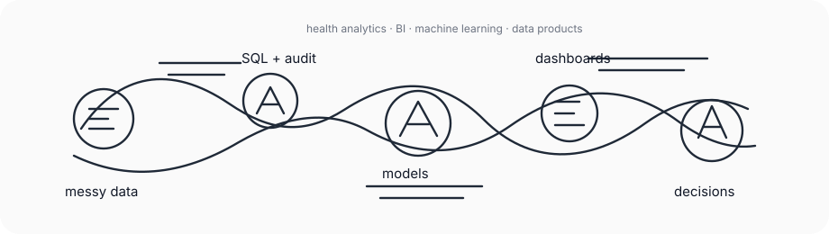

# Luanda Rodrigues

**Data Analyst · Health Analytics · BI · SQL · Machine Learning**

I turn complex health, operational and public datasets into readable analysis, decision-ready dashboards, reproducible notebooks and portfolio-grade data products.

[Portfolio](https://luandarodrigues-portfolio.vercel.app/) ·
[GitLab](https://gitlab.com/luanda-rodrigues) ·
[LinkedIn](https://www.linkedin.com/in/luanda-rodrigues) ·
[Email](mailto:luandarodrigues30@gmail.com)

## What I Work On

| Signal | How I use it |
| --- | --- |
| Public-health and clinical context | WHO indicators, telemedicine access, UBS/APS evidence, cautious model interpretation. |
| Business and operations data | KPI logic, delivery experience, workforce pressure, retention and decision framing. |
| Analytical engineering | SQL layers, Python pipelines, DuckDB, BigQuery, Snowflake and Databricks-oriented flows. |
| Models and reports | Validation, temporal holdouts, residual analysis, notebook reports and transparent limitations. |

## Selected Work

| Project | Focus |
| --- | --- |
| [WHO Global Health Signals](https://gitlab.com/luanda-rodrigues/who-global-health-signals) | Life-expectancy modeling with WHO public indicators, temporal validation and interpretable reporting. |
| [Brazil Telemedicine Access Atlas](https://gitlab.com/luanda-rodrigues/luandarodrigues/-/tree/main/projects/ubs-healthcare-mapping) | Municipal access analysis for telemedicine opportunity in Brazil, combining UBS, pharmacies and census-sector evidence. |
| [Olist Delivery Experience Analytics](https://gitlab.com/luanda-rodrigues/olist-delivery-experience-analytics) | Brazilian e-commerce delivery and satisfaction analytics with SQL, logistics features and ML-ready outputs. |
| [Crypto Market Intelligence Lakehouse](https://gitlab.com/luanda-rodrigues/crypto-market-intelligence-lakehouse) | Market intelligence pipeline with medallion layers, public APIs and app-facing outputs. |
| [CineGraph Network Intelligence](https://gitlab.com/luanda-rodrigues/cinegraph-network-intelligence) | Graph analytics, NLP and recommender-system thinking for media data. |
| [Notebook Reports](https://gitlab.com/luanda-rodrigues/projectsforjupyternotebook) | Smaller statistical studies in report-first notebooks: Bayesian signals, causal inference, market regimes and macro clusters. |

## Stack

`Python` · `SQL` · `Pandas` · `DuckDB` · `Scikit-learn` · `Power BI` · `Looker Studio` · `BigQuery` · `Snowflake` · `Databricks` · `GitLab` · `Astro`

## Current Direction

I am shaping my portfolio around analytical products that are:

- **auditable**: clear data provenance, checks and assumptions;
- **explainable**: visual outputs with the reasoning visible;
- **practical**: built around decisions, not just metrics;
- **careful**: uncertainty and limitations stay in the frame.

## Learning

Recent coursework and practice: Google Project Management, Snowflake Data Engineering, Data Analytics on Google Cloud, Looker Studio Pro, Power BI with Copilot, and Databricks-oriented architecture.

## Tags

`data-analytics` `business-intelligence` `health-analytics` `machine-learning` `cloud-analytics` `data-products` `python` `sql` `duckdb` `bigquery` `snowflake` `databricks`
