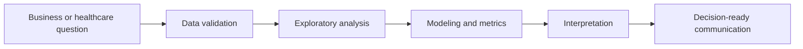

<div align="center">


<br />

<a href="https://luandarodrigues.github.io/luandarodrigues/">
  
</a>
<a href="https://www.linkedin.com/in/luanda-rodrigues">
  
</a>
<a href="mailto:luandarodrigues30@gmail.com">
  
</a>
<a href="https://www.behance.net/luandarodrguez">
  
</a>

<br /><br />

<strong>Brazilian professional · Available for remote roles · Open to relocation</strong>

</div>

---

## About

I build analytical projects that connect **healthcare operations, business intelligence, machine learning and data quality** to support better decisions.

My background combines **Biomedical Engineering, Hospital Management, clinical pharmacy operations, KPI monitoring, public health datasets, digital projects and AI-supported workflows**. I work with data not only as a technical layer, but as a way to understand processes, identify bottlenecks and translate findings into action.

Currently, my portfolio connects:

<table>
  <tr>
    <td><strong>Health Analytics</strong></td>
    <td>Public health datasets, hospital workflows, clinical pharmacy indicators and service performance.</td>
  </tr>
  <tr>
    <td><strong>Business Intelligence</strong></td>
    <td>KPI design, dashboards, executive reporting and operational monitoring.</td>
  </tr>
  <tr>
    <td><strong>Machine Learning</strong></td>
    <td>Classification models, model evaluation, clinical risk and business risk analysis.</td>
  </tr>
  <tr>
    <td><strong>Graph + NLP</strong></td>
    <td>NetworkX, recommendation networks, relationship modeling, TF-IDF and review text mining.</td>
  </tr>
  <tr>
    <td><strong>Operations Analytics</strong></td>
    <td>Bottleneck detection, workflow optimization, logistics performance and customer experience.</td>
  </tr>
</table>

---

## Featured Projects

<table>
  <tr>
    <td width="50%" valign="top">
      <h3>01 · Mapping Primary Healthcare Units in Brazil</h3>
      <p><strong>Health Analytics · Geomapping · Data Quality · Public Health BI</strong></p>
      <p>Analysis of 47,714 Brazilian Primary Healthcare Units to map geographic distribution, evaluate coordinate quality and identify opportunities for better public health data governance.</p>
      <p>
        
        
        
      </p>
      <p><a href="./projects/ubs-healthcare-mapping"><strong>Open project →</strong></a></p>
    </td>
    <td width="50%" valign="top">
      <h3>02 · Heart Disease Risk Prediction</h3>
      <p><strong>Machine Learning · Clinical Risk Factors · Model Evaluation</strong></p>
      <p>Machine learning project using 918 patient records and 11 clinical predictors to evaluate heart disease classification models and discuss clinical and ethical limitations.</p>
      <p>
        
        
        
      </p>
      <p><a href="./projects/heart-disease-risk-ml"><strong>Open project →</strong></a></p>
    </td>
  </tr>
  <tr>
    <td width="50%" valign="top">
      <h3>03 · Brazilian E-Commerce Delivery Experience</h3>
      <p><strong>SQL · Logistics · Customer Experience · Machine Learning</strong></p>
      <p>Analysis of the Brazilian Olist public e-commerce dataset to understand how logistics, delivery delays, payment behavior and product categories affect customer satisfaction.</p>
      <p>
        
        
        
      </p>
      <p><a href="./projects/olist-ecommerce-experience-analytics"><strong>Open project →</strong></a></p>
    </td>
    <td width="50%" valign="top">
      <h3>04 · CineGraph Network Intelligence</h3>
      <p><strong>Graph Analytics · Recommender Systems · NLP · Knowledge Graphs</strong></p>
      <p>Advanced media analytics project using a large TMDB graph dataset to analyze relationship integrity, co-star networks, recommendation edges, streaming availability and review text signals.</p>
      <p>
        
        
        
      </p>
      <p><a href="./projects/cinegraph-network-intelligence"><strong>Open project →</strong></a></p>
    </td>
  </tr>
</table>

---

## Technical Toolkit

<div align="center">


<br /><br />


</div>

```text
Data Analysis      Python · Pandas · NumPy · Excel · exploratory analysis
BI & Dashboards    Power BI · Looker · KPI monitoring · executive reporting
ML & Modeling      Scikit-learn · classification · model evaluation · ROC-AUC · F1-score
Graph Analytics    NetworkX · edge lists · relationship coverage · recommender graphs
NLP                TF-IDF · review mining · sentiment signals · text feature extraction
Databases          SQL · SQLite-ready queries · analytical marts · structured data modeling
Healthcare         Hospital operations · pharmacy workflows · public health datasets
Operations         Bottlenecks · Lean Six Sigma · workflow optimization · decision support
Automation         AI tools · low-code workflows · health communication projects
```

---

## Confidential & Applied Work

Some applied work cannot be publicly shared because it involves institutional or private company data. I present these projects through anonymized descriptions and transferable skills.

| Project | Context | Skills demonstrated |
|---|---|---|
| **Clinical Pharmacy KPI Dashboard** | Confidential — EBSERH / HC-UFU | KPI design, hospital workflow analysis, operational monitoring, decision support |
| **AI for Scientific Communication in Healthcare** | Confidential — private healthcare companies | Applied AI, automation, health communication, content strategy, low-code workflows |
| **Performance Dashboard for Decision-Making** | Confidential — corporate context | BI structure, executive reporting, dashboard design, business analysis |

---

## Background

- **Hospital Management** — UNAMA
- **Biomedical Engineering** — Universidade Federal do Pará
- **Aspire Leadership Program** — Aspire Institute
- Healthcare operations, clinical pharmacy workflows and health data analysis
- Marketing and scientific communication projects involving content creation, HTML email marketing, design, automation and AI-supported workflows

---

## How I approach data projects



---

<div align="center">

### Portfolio

<a href="https://luandarodrigues.github.io/luandarodrigues/">
  
</a>

<br /><br />

· [LinkedIn](https://www.linkedin.com/in/luanda-rodrigues) · [Behance](https://www.behance.net/luandarodrguez) · [Email](mailto:luandarodrigues30@gmail.com) ·

</div>


