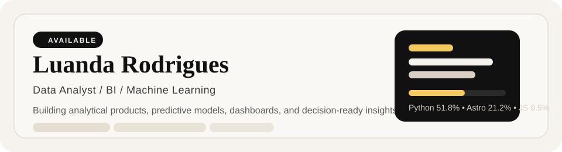
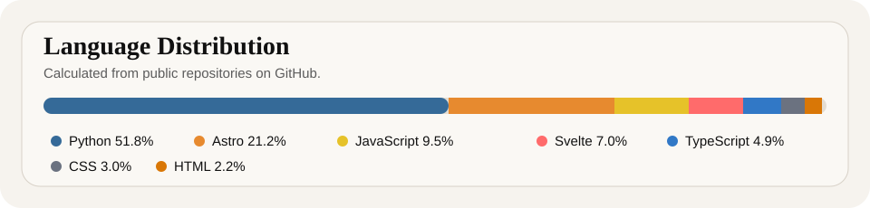

  <picture>
    <source media="(prefers-color-scheme: dark)" srcset="./docs/assets/readme-header-minimal-dark.svg" />
    
  </picture>

   

  
  
  

## About

I work with data from the first messy table to the final readout: dashboards, KPIs, models, notebooks, and reports that make the reasoning easy to check.

My main portfolio lives on Vercel. GitHub is where I keep the working parts behind it: code, notebooks, charts, checks, and the notes behind each choice.

## Start Here

| Link | What to expect |
| --- | --- |
| [Portfolio](https://luandarodrigues-portfolio.vercel.app/) | Case studies, notebook reports, and the cleanest view of my work |
| [Notebook reports](https://github.com/luandarodrigues/projectsforjupyternotebook) | Jupyter projects written like small reports, with charts, results, and reproducible checks |
| [Crypto intelligence lakehouse](https://github.com/luandarodrigues/crypto-market-intelligence-lakehouse) | Databricks-oriented market intelligence with lakehouse layers, public APIs, and an app layer |
| [Delivery analytics project](https://github.com/luandarodrigues/olist-delivery-experience-analytics) | E-commerce delivery experience analysis with SQL, modeling, and executive outputs |

## Stack

  
  
  
  
  
  
  
  
  
  
  
  
  

## Learning

  
  
  
  
  

Recent coursework sharpened the same stack I use in projects: Google Cloud with BigQuery and Looker Studio, Snowflake data engineering, Power BI with Copilot, and project management through Google/Credly.

## Focus

  
  
  
  
  
  
  

## Current Notebook Work

I am turning notebooks into GitHub-readable reports, with the main charts and findings in each project README.

Recent work:

- Bayesian pharmacovigilance for GLP-1 drugs with openFDA/FAERS.
- Causal inference for remote salary premium, with AIPW, DML, and uncertainty intervals.
- Crypto market regime detection with recent Binance BTC/ETH data.
- Brazil inflation and monetary regimes with BCB/SGS series and a bibliography behind the model choices.

Next up: a survival analysis project for customer churn, with the same report-first format.

## Profile Analysis

<picture>
  <source media="(prefers-color-scheme: dark)" srcset="./docs/assets/language-map-dark.svg" />
  
</picture>

## Tags

`data-analytics` `business-intelligence` `machine-learning` `cloud-analytics` `data-products` `python` `sql` `duckdb` `bigquery` `snowflake` `databricks` `power-bi` `looker-studio` `copilot` `predictive-modeling` `data-quality` `kpi`
