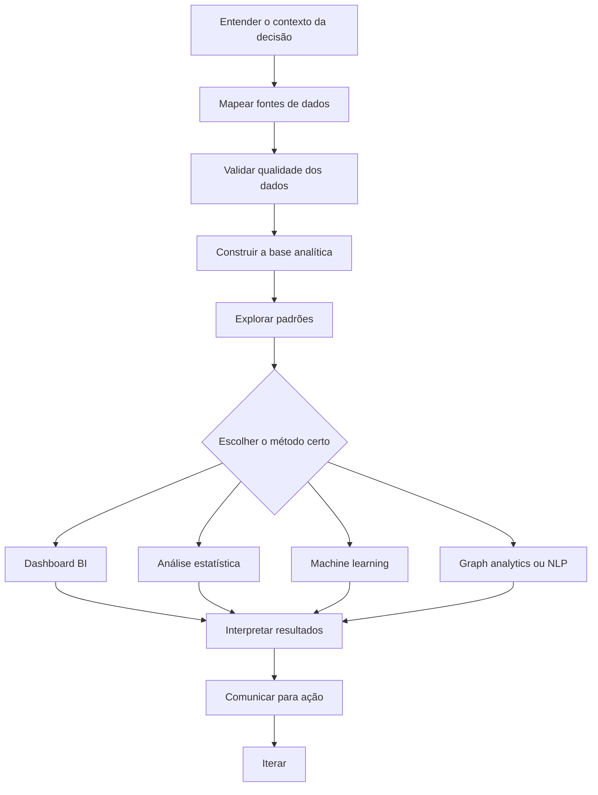

<div align="center">


<br />

<a href="./README.md">English</a> · <a href="./README.pt-BR.md"><strong>Português</strong></a>

<br /><br />


<br />

<a href="https://luandarodrigues.github.io/luandarodrigues/">
  
</a>
<a href="https://github.com/luandarodrigues/ubs-aps-territorial-intelligence">
  
</a>
<a href="https://www.linkedin.com/in/luanda-rodrigues">
  
</a>
<a href="mailto:luandarodrigues30@gmail.com">
  
</a>

<br /><br />

<strong>Profissional brasileira · Disponível para remoto · Aberta à relocação</strong>

</div>

---

## Hub de perfil

Este repositório funciona como um **hub de perfil**. Ele mantém o README público, os assets visuais e os links para os repositórios do portfólio. Os principais projetos estão separados em repositórios próprios para facilitar a leitura por recrutadores, avaliadores técnicos e pessoas interessadas nos estudos.

Construo projetos analíticos que conectam **operações em saúde, business intelligence, machine learning, qualidade de dados, experiência do cliente e inteligência para decisão**. Minha trajetória combina Engenharia Biomédica, Gestão Hospitalar, operações de farmácia clínica, monitoramento de KPIs, dados públicos de saúde, projetos digitais e fluxos apoiados por IA.

<table>
  <tr>
    <td><strong>Health Analytics</strong></td>
    <td>Dados públicos de saúde, fluxos hospitalares, indicadores de farmácia clínica e performance de serviços.</td>
  </tr>
  <tr>
    <td><strong>Business Intelligence</strong></td>
    <td>Desenho de KPIs, dashboards, relatórios executivos e monitoramento operacional.</td>
  </tr>
  <tr>
    <td><strong>Machine Learning</strong></td>
    <td>Modelos de classificação, avaliação de modelos, risco clínico, risco de CX e risco de negócio.</td>
  </tr>
  <tr>
    <td><strong>Graph + NLP</strong></td>
    <td>NetworkX, redes de recomendação, modelagem de relações, TF-IDF e mineração de reviews.</td>
  </tr>
  <tr>
    <td><strong>Operations Analytics</strong></td>
    <td>Detecção de gargalos, otimização de fluxos, performance logística e experiência do cliente.</td>
  </tr>
</table>

---

## Repositórios em destaque

<table>
  <tr>
    <td width="50%" valign="top">
      <h3>UBS + IBGE + Cobertura Potencial APS</h3>
      <p><strong>Health Analytics · Inteligência Territorial · BI em Saúde Pública · Qualidade de Dados</strong></p>
      <p>Projeto interativo de análise em saúde pública que integra o cadastro brasileiro de UBS com indicadores territoriais do IBGE/SIDRA e dados de Cobertura Potencial da APS.</p>
      <p>O projeto compara presença física da rede, pressão populacional, dispersão territorial, qualidade de coordenadas e capacidade instalada estimada da Atenção Primária.</p>
      <p>
        
        
        
      </p>
      <p>
        <a href="https://github.com/luandarodrigues/ubs-aps-territorial-intelligence"><strong>Abrir repositório →</strong></a><br />
        <a href="https://luandarodrigues.github.io/luandarodrigues/dashboards/ubs-healthcare-mapping/?v=aps2"><strong>Abrir painel →</strong></a>
      </p>
    </td>
    <td width="50%" valign="top">
      <h3>Olist Delivery Experience Analytics</h3>
      <p><strong>Marketplace Analytics · Performance Logística · SQL Mart · Risco de CX · Storytelling Dashboard</strong></p>
      <p>Projeto de storytelling de negócio com a base pública da Olist para mostrar como atrito logístico vira insatisfação do cliente, pressão de custo e oportunidade operacional.</p>
      <p>O painel inclui camada de auditoria com dados brutos via Git LFS, CSVs analíticos derivados, lógica de transformação SQL, análise de cenários e interface bilíngue PT/EN inspirada na identidade visual da Olist.</p>
      <p>
        
        
        
        
      </p>
      <p>
        <a href="https://github.com/luandarodrigues/olist-delivery-experience-analytics"><strong>Abrir repositório →</strong></a><br />
        <a href="https://luandarodrigues.github.io/olist-delivery-experience-analytics/?v=4"><strong>Abrir painel →</strong></a>
      </p>
    </td>
  </tr>
</table>

---

## Repositórios de projetos

<table>
  <tr>
    <th align="left">Repositório</th>
    <th align="left">Foco</th>
    <th align="left">Status</th>
  </tr>
  <tr>
    <td><a href="https://github.com/luandarodrigues/ubs-aps-territorial-intelligence"><strong>UBS + IBGE + APS Territorial Intelligence</strong></a></td>
    <td>Health analytics, inteligência territorial, BI em saúde pública</td>
    <td><a href="https://luandarodrigues.github.io/luandarodrigues/dashboards/ubs-healthcare-mapping/?v=aps2">Painel publicado</a></td>
  </tr>
  <tr>
    <td><a href="https://github.com/luandarodrigues/heart-disease-risk-prediction"><strong>Heart Disease Risk Prediction</strong></a></td>
    <td>Machine learning clínico, avaliação de modelos, responsible ML</td>
    <td><a href="https://luandarodrigues.github.io/heart-disease-risk-prediction/?v=5">Painel publicado</a></td>
  </tr>
  <tr>
    <td><a href="https://github.com/luandarodrigues/olist-delivery-experience-analytics"><strong>Brazilian E-Commerce Delivery Experience</strong></a></td>
    <td>SQL, logística, satisfação do cliente, risco de atraso/baixa avaliação, storytelling dashboard</td>
    <td><a href="https://luandarodrigues.github.io/olist-delivery-experience-analytics/?v=4">Painel publicado</a></td>
  </tr>
  <tr>
    <td><a href="https://github.com/luandarodrigues/cinegraph-network-intelligence"><strong>CineGraph Network Intelligence</strong></a></td>
    <td>Graph analytics, sistemas de recomendação, NLP, dados de mídia</td>
    <td>Repositório criado; README e sheets serão refinados em seguida</td>
  </tr>
</table>

---

## Ferramentas e stack

<div align="center">


<br /><br />


</div>

```text
Análise de Dados     Python · Pandas · NumPy · Excel · análise exploratória
BI & Dashboards      Power BI · Looker · KPIs · relatórios executivos
ML & Modelagem       Scikit-learn · classificação · avaliação de modelos · ROC-AUC · F1-score
Graph Analytics      NetworkX · listas de arestas · cobertura de relações · grafos de recomendação
NLP                  TF-IDF · mineração de reviews · sinais de sentimento · extração de features textuais
Bancos de Dados      SQL · consultas SQLite-ready · marts analíticos · modelagem estruturada
Saúde                Operações hospitalares · fluxos de farmácia · bases públicas de saúde
Operações            Gargalos · Lean Six Sigma · otimização de fluxos · apoio à decisão
CX Analytics         Reviews · risco de entrega · insatisfação do cliente · operações de marketplace
Automação            Ferramentas de IA · low-code · comunicação em saúde
```

---

## Trabalhos aplicados e confidenciais

Parte do meu trabalho aplicado não pode ser compartilhada publicamente por envolver dados institucionais ou de empresas privadas. Esses projetos são apresentados por descrições anonimizadas e competências transferíveis.

| Projeto | Contexto | Competências demonstradas |
|---|---|---|
| **Clinical Pharmacy KPI Dashboard** | Confidencial — EBSERH / HC-UFU | Desenho de KPIs, análise de fluxos hospitalares, monitoramento operacional, apoio à decisão |
| **AI for Scientific Communication in Healthcare** | Confidencial — empresas privadas de saúde | IA aplicada, automação, comunicação em saúde, estratégia de conteúdo, low-code |
| **Performance Dashboard for Decision-Making** | Confidencial — contexto corporativo | Estrutura de BI, relatório executivo, desenho de dashboard, análise de negócio |

---

## Formação e trajetória

- **Gestão Hospitalar** — UNAMA
- **Engenharia Biomédica** — Universidade Federal do Pará
- **Aspire Leadership Program** — Aspire Institute
- Operações em saúde, fluxos de farmácia clínica e análise de dados em saúde
- Projetos de marketing e comunicação científica envolvendo criação de conteúdo, e-mail marketing em HTML, design, automação e fluxos apoiados por IA

---

## Como penso projetos de dados



---

<div align="center">

### Portfólio

<a href="https://luandarodrigues.github.io/luandarodrigues/">
  
</a>

<br /><br />

· [LinkedIn](https://www.linkedin.com/in/luanda-rodrigues) · [Behance](https://www.behance.net/luandarodrguez) · [E-mail](mailto:luandarodrigues30@gmail.com) ·

</div>
