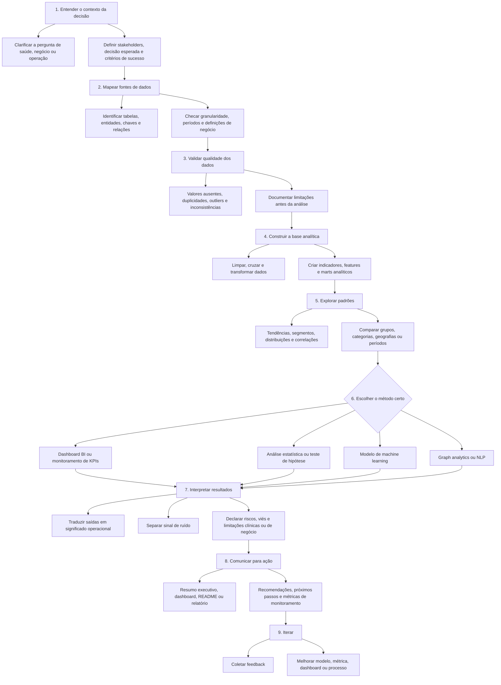

<div align="center">


<br />

<a href="./README.md">English</a> · <a href="./README.pt-BR.md"><strong>Português</strong></a>

<br /><br />


<br />

<a href="https://luandarodrigues.github.io/luandarodrigues/">
  
</a>
<a href="https://www.linkedin.com/in/luanda-rodrigues">
  
</a>
<a href="mailto:luandarodrigues30@gmail.com">
  
</a>
<a href="https://www.behance.net/luandarodrguez">
  
</a>

<br /><br />

<strong>Profissional brasileira · Disponível para remoto · Aberta à relocação</strong>

</div>

---

## Sobre

Construo projetos analíticos que conectam **operações em saúde, business intelligence, machine learning e qualidade de dados** para apoiar melhores decisões.

Minha trajetória combina **Engenharia Biomédica, Gestão Hospitalar, operações de farmácia clínica, monitoramento de KPIs, dados públicos de saúde, projetos digitais e fluxos apoiados por IA**. Trabalho com dados não apenas como camada técnica, mas como forma de entender processos, identificar gargalos e traduzir achados em ação.

Atualmente, meu portfólio conecta:

<table>
  <tr>
    <td><strong>Health Analytics</strong></td>
    <td>Dados públicos de saúde, fluxos hospitalares, indicadores de farmácia clínica e performance de serviços.</td>
  </tr>
  <tr>
    <td><strong>Business Intelligence</strong></td>
    <td>Desenho de KPIs, dashboards, relatórios executivos e monitoramento operacional.</td>
  </tr>
  <tr>
    <td><strong>Machine Learning</strong></td>
    <td>Modelos de classificação, avaliação de modelos, risco clínico e risco de negócio.</td>
  </tr>
  <tr>
    <td><strong>Graph + NLP</strong></td>
    <td>NetworkX, redes de recomendação, modelagem de relações, TF-IDF e mineração de reviews.</td>
  </tr>
  <tr>
    <td><strong>Operations Analytics</strong></td>
    <td>Detecção de gargalos, otimização de fluxos, performance logística e experiência do cliente.</td>
  </tr>
</table>

---

## Projetos em destaque

<table>
  <tr>
    <td width="50%" valign="top">
      <h3>01 · Mapping Primary Healthcare Units in Brazil</h3>
      <p><strong>Health Analytics · Geomapping · Data Quality · Public Health BI</strong></p>
      <p>Análise de 47.714 Unidades Básicas de Saúde brasileiras para mapear distribuição geográfica, avaliar qualidade de coordenadas e identificar oportunidades de governança de dados em saúde pública.</p>
      <p><a href="./projects/ubs-healthcare-mapping"><strong>Abrir projeto →</strong></a></p>
    </td>
    <td width="50%" valign="top">
      <h3>02 · Heart Disease Risk Prediction</h3>
      <p><strong>Machine Learning · Clinical Risk Factors · Model Evaluation</strong></p>
      <p>Projeto de machine learning com 918 registros clínicos e 11 preditores para avaliar modelos de classificação de doença cardíaca e discutir limitações clínicas e éticas.</p>
      <p><a href="./projects/heart-disease-risk-ml"><strong>Abrir projeto →</strong></a></p>
    </td>
  </tr>
  <tr>
    <td width="50%" valign="top">
      <h3>03 · Brazilian E-Commerce Delivery Experience</h3>
      <p><strong>SQL · Logistics · Customer Experience · Machine Learning</strong></p>
      <p>Análise da base pública da Olist para entender como logística, atraso de entrega, pagamentos e categorias de produto afetam a satisfação do cliente.</p>
      <p><a href="./projects/olist-ecommerce-experience-analytics"><strong>Abrir projeto →</strong></a></p>
    </td>
    <td width="50%" valign="top">
      <h3>04 · CineGraph Network Intelligence</h3>
      <p><strong>Graph Analytics · Recommender Systems · NLP · Knowledge Graphs</strong></p>
      <p>Projeto avançado de media analytics usando uma grande base TMDB em grafo para analisar integridade de relações, redes de colaboração, recomendações, streaming e reviews.</p>
      <p><a href="./projects/cinegraph-network-intelligence"><strong>Abrir projeto →</strong></a></p>
    </td>
  </tr>
</table>

---

## Ferramentas e stack

<div align="center">


<br /><br />


</div>

```text
Análise de Dados     Python · Pandas · NumPy · Excel · análise exploratória
BI & Dashboards      Power BI · Looker · KPIs · relatórios executivos
ML & Modelagem       Scikit-learn · classificação · avaliação de modelos · ROC-AUC · F1-score
Graph Analytics      NetworkX · listas de arestas · cobertura de relações · grafos de recomendação
NLP                  TF-IDF · mineração de reviews · sinais de sentimento · extração de features textuais
Bancos de Dados      SQL · consultas SQLite-ready · marts analíticos · modelagem estruturada
Saúde                Operações hospitalares · fluxos de farmácia · bases públicas de saúde
Operações            Gargalos · Lean Six Sigma · otimização de fluxos · apoio à decisão
Automação            Ferramentas de IA · low-code · comunicação em saúde
```

---

## Trabalhos confidenciais e aplicados

Parte do meu trabalho aplicado não pode ser compartilhada publicamente por envolver dados institucionais ou de empresas privadas. Esses projetos são apresentados por descrições anonimizadas e competências transferíveis.

| Projeto | Contexto | Competências demonstradas |
|---|---|---|
| **Clinical Pharmacy KPI Dashboard** | Confidencial — EBSERH / HC-UFU | Desenho de KPIs, análise de fluxos hospitalares, monitoramento operacional, apoio à decisão |
| **AI for Scientific Communication in Healthcare** | Confidencial — empresas privadas de saúde | IA aplicada, automação, comunicação em saúde, estratégia de conteúdo, low-code |
| **Performance Dashboard for Decision-Making** | Confidencial — contexto corporativo | Estrutura de BI, relatório executivo, desenho de dashboard, análise de negócio |

---

## Formação e trajetória

- **Gestão Hospitalar** — UNAMA
- **Engenharia Biomédica** — Universidade Federal do Pará
- **Aspire Leadership Program** — Aspire Institute
- Operações em saúde, fluxos de farmácia clínica e análise de dados em saúde
- Projetos de marketing e comunicação científica envolvendo criação de conteúdo, e-mail marketing em HTML, design, automação e fluxos apoiados por IA

---

## Como penso projetos de dados

Trato projetos de dados como sistemas de decisão. O objetivo não é apenas criar gráficos ou modelos, mas entender a pergunta operacional, testar a confiabilidade da base, escolher o método correto e comunicar conclusões com limitações claras.



---

<div align="center">

### Portfólio

<a href="https://luandarodrigues.github.io/luandarodrigues/">
  
</a>

<br /><br />

· [LinkedIn](https://www.linkedin.com/in/luanda-rodrigues) · [Behance](https://www.behance.net/luandarodrguez) · [E-mail](mailto:luandarodrigues30@gmail.com) ·

</div>
