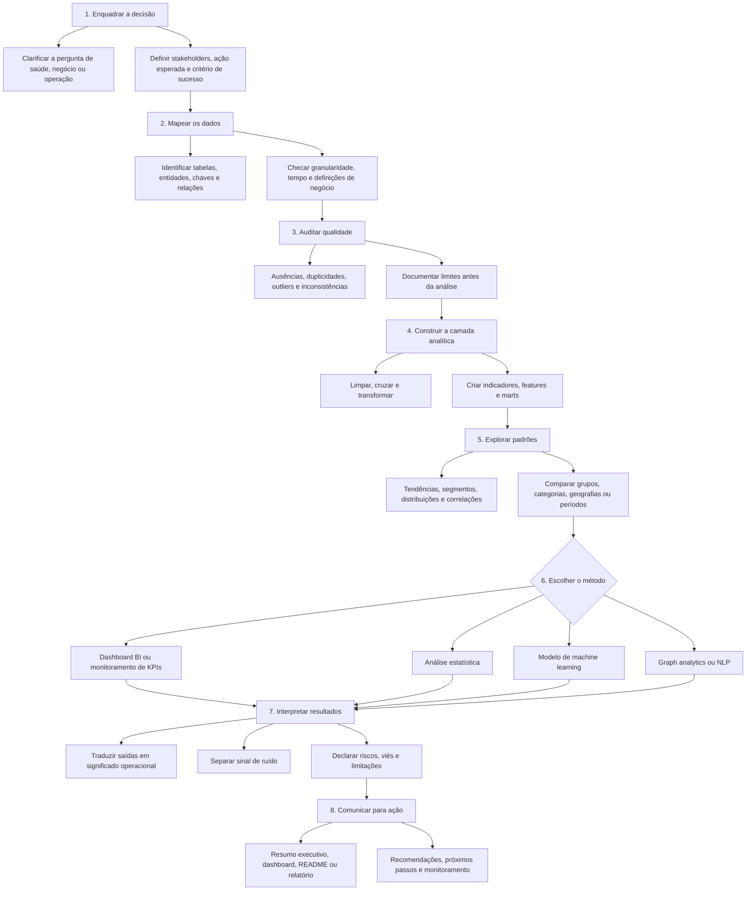

<div align="center">

<picture>
  <source media="(prefers-color-scheme: dark)" srcset="./docs/assets/readme-header-dark.svg" />
  
</picture>

<br />

<a href="./README.md">English</a> · <a href="./README.pt-BR.md"><strong>Português</strong></a>

<br /><br />


<br />

<a href="https://luandarodrigues-portfolio.vercel.app/">
  
</a>
<a href="https://who-global-health-signals.vercel.app/">
  
</a>
<a href="https://www.linkedin.com/in/luanda-rodrigues">
  
</a>
<a href="mailto:luandarodrigues30@gmail.com">
  
</a>

<br /><br />

<strong>Profissional brasileira · Disponível para trabalho remoto · Aberta à relocação</strong>

</div>

---

## Sobre

Construo produtos analíticos que conectam **operações em saúde, dados públicos, BI, machine learning e comunicação para decisão**.

Minha trajetória combina **Engenharia Biomédica, Gestão Hospitalar, rotinas de farmácia clínica, monitoramento de KPIs, bases públicas de saúde e fluxos apoiados por IA**. Trabalho com dados como sistema operacional: entender a pergunta, auditar a base, modelar o sinal, expor os limites e transformar o resultado em ação.

Hoje meu portfólio se organiza em cinco camadas complementares:

| Camada | Foco |
|---|---|
| **Health analytics** | Indicadores públicos de saúde, infraestrutura assistencial, fluxos hospitalares e performance de serviços |
| **Inteligência para decisão** | Desenho de KPIs, relatórios executivos, dashboards e framing da decisão |
| **Machine learning** | Modelos preditivos, validação, benchmark e interpretação responsável |
| **Grafos + NLP** | Relações em rede, lógica de recomendação, TF-IDF e sinais textuais |
| **Analytics operacional** | Gargalos, logística, experiência do cliente e otimização de fluxos |

---

## Produto Principal

### WHO Global Health Signals

**Pergunta:** indicadores públicos de saúde conseguem explicar e prever diferenças de expectativa de vida entre países?

Este projeto reconstruiu indicadores públicos da OMS em um painel analítico país-ano, auditou a qualidade dos dados upstream, comparou modelos locais pesados com TabPFN, analisou resíduos e publicou o resultado em um relatório executivo interativo.

**Resultado final**

- `13.785` linhas analíticas
- `218` países e entidades
- `0,110` de MAE com `TabPFN`
- `0,243` de MAE no melhor modelo totalmente local

**Por que importa**

O projeto mostra que indicadores públicos de saúde explicam muito bem diferenças de expectativa de vida, enquanto a análise de resíduos ainda destaca onde o contexto adicional de cada país continua importando. É ao mesmo tempo benchmark de machine learning e produto de inteligência para decisão.

**Abrir**

- [Relatório ao vivo](https://who-global-health-signals.vercel.app/)
- [Repositório](https://github.com/luandarodrigues/who-global-health-signals)

---

## Arquivo Selecionado

| Projeto | Foco | Resumo |
|---|---|---|
| [Mapping Primary Healthcare Units in Brazil](./projects/ubs-healthcare-mapping) | Health analytics · Geomapping · Data quality | `47.714` unidades com análise de cobertura e qualidade de coordenadas |
| [Heart Disease Risk Prediction](./projects/heart-disease-risk-ml) | Machine learning · Risco clínico | `918` registros clínicos e avaliação responsável de modelos |
| [Brazilian E-Commerce Delivery Experience](./projects/olist-ecommerce-experience-analytics) | SQL · Logística · Experiência do cliente | `99.441` pedidos conectando atraso, frete e reviews |
| [CineGraph Network Intelligence](./projects/cinegraph-network-intelligence) | Grafos · NLP · Recomendação | Análise de mídia em grafo com integridade relacional e lógica de recomendação |

---

## Ferramentas e Stack

```text
Análise             Python · Pandas · NumPy · exploração · engenharia de atributos
BI e Relatórios     Power BI · Looker · desenho de KPIs · dashboards executivos
ML e Benchmark      Scikit-learn · comparação de modelos · ROC-AUC · resíduos
Grafos e NLP        NetworkX · TF-IDF · modelagem relacional · mineração de reviews
Qualidade de Dados  Auditorias de completude · recortes temporais · consistência
Bancos de Dados     SQL · joins analíticos · marts · modelagem estruturada
Saúde               Farmácia clínica · operações hospitalares · dados públicos
Comunicação         Estratégia de README · narrativa analítica · decisão orientada
```

---

## Trabalho Aplicado

Parte do meu trabalho aplicado não pode ser compartilhada publicamente porque envolve dados institucionais ou de empresas privadas. Esses casos aparecem por descrições anonimizadas e competências transferíveis.

| Projeto | Contexto | Competências demonstradas |
|---|---|---|
| **Clinical Pharmacy KPI Dashboard** | Confidencial — EBSERH / HC-UFU | Desenho de KPIs, análise de fluxos hospitalares, monitoramento operacional, apoio à decisão |
| **AI for Scientific Communication in Healthcare** | Confidencial — empresas privadas de saúde | IA aplicada, automação, comunicação em saúde, estratégia de conteúdo, low-code |
| **Performance Dashboard for Decision-Making** | Confidencial — contexto corporativo | Estrutura de BI, relatório executivo, dashboard design, análise de negócio |

---

## Formação e Trajetória

- **Gestão Hospitalar** — UNAMA
- **Engenharia Biomédica** — Universidade Federal do Pará
- **Aspire Leadership Program** — Aspire Institute
- Operações em saúde, fluxos de farmácia clínica e análise de dados em saúde pública
- Projetos de marketing technology e comunicação científica envolvendo HTML email, conteúdo, design, automação e IA

---

## Como penso produtos de dados

Trato projetos de dados como sistemas de decisão. O objetivo não é apenas produzir gráficos ou modelos, mas entender a pergunta operacional, testar a confiabilidade da base, escolher o método certo e comunicar conclusões com limites explícitos.



---

<div align="center">

### Portfólio

<a href="https://luandarodrigues-portfolio.vercel.app/">
  
</a>

<br /><br />

· [LinkedIn](https://www.linkedin.com/in/luanda-rodrigues) · [Relatório WHO](https://who-global-health-signals.vercel.app/) · [E-mail](mailto:luandarodrigues30@gmail.com) ·

</div>
