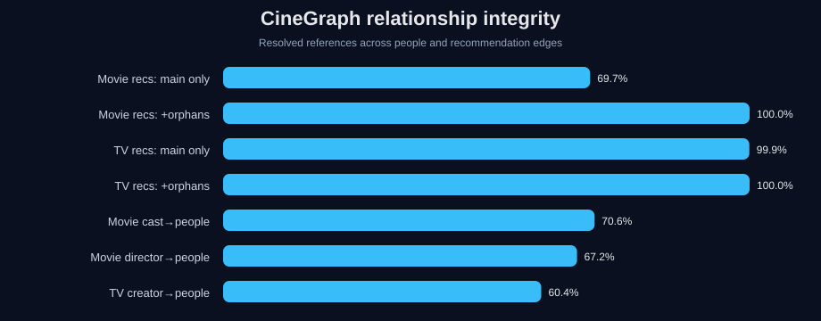
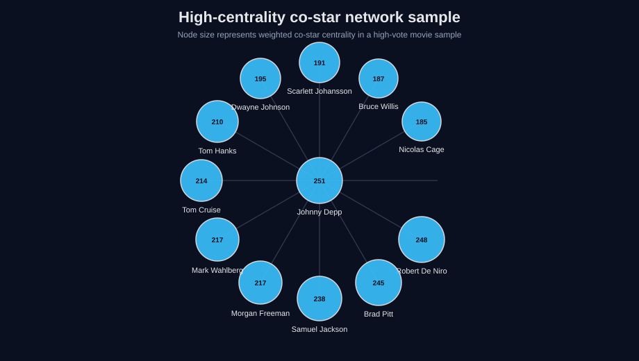
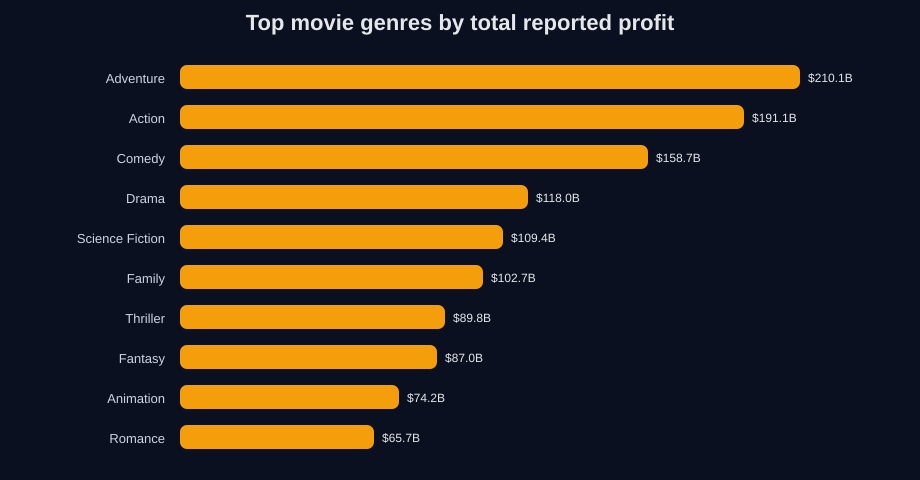
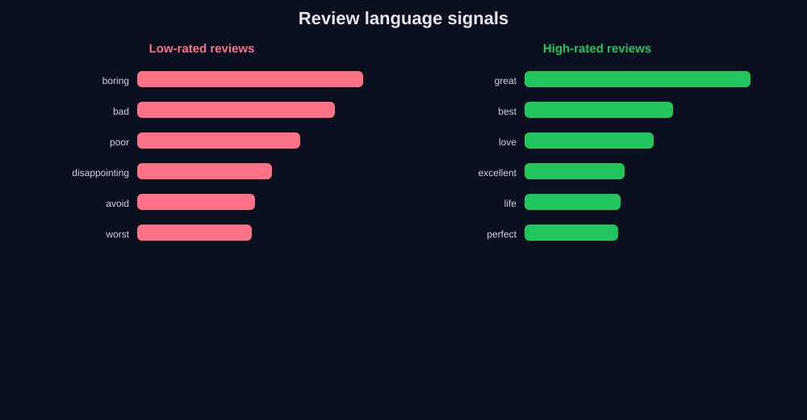

# CineGraph Network Intelligence

**Graph Analytics | Recommender Systems | NLP | Knowledge Graphs | RAG-Ready Data Modeling**

This project explores the CineGraph TMDB dataset as a connected media graph, not as a flat movie table.

The objective is to demonstrate advanced analytics skills across graph modeling, relationship integrity, recommendation networks, cast collaboration analysis, streaming availability and review text mining.



## Analytical question

How can a large-scale entertainment dataset be transformed into a graph intelligence layer for recommendation analysis, content strategy, review mining and RAG-ready knowledge systems?

## Dataset

CineGraph contains normalized TMDB-based data for movies, TV shows, people, orphans and reviews.

| Table | Rows | Description |
|---|---:|---|
| Movies | 22,393 | Full movie metadata, financials, cast, recommendations and streaming availability |
| TV Shows | 15,562 | Series metadata, creators, cast, networks, certifications and streaming availability |
| People | 58,393 | Cast, directors, creators and social/profile metadata |
| Orphan Movies | 8,068 | Lightweight movie nodes referenced by recommendation edges |
| Orphan TV | 3,389 | Lightweight TV nodes referenced by recommendation edges |
| Movie Reviews | 22,712 | Text reviews and optional ratings |
| TV Reviews | 2,923 | Text reviews and optional ratings |

## Why this project is different

Previous portfolio projects focused on healthcare, BI, logistics and predictive modeling. This project adds a different layer of technical depth:

- graph-first data modeling
- many-to-many edge extraction from comma-separated IDs
- entity resolution and relationship coverage analysis
- co-star collaboration network analysis
- recommendation graph analysis with orphan node handling
- review text mining with TF-IDF
- RAG-ready thinking for media knowledge retrieval

## Key graph metrics

| Relationship | Resolved reference coverage |
|---|---:|
| Movie recommendations, main corpus only | 69.7% |
| Movie recommendations, with orphan movies | 100.0% |
| TV recommendations, main corpus only | 99.9% |
| TV recommendations, with orphan TV | 100.0% |
| Movie cast IDs resolved to people | 70.6% |
| Movie director IDs resolved to people | 67.2% |
| TV creator IDs resolved to people | 60.4% |

The orphan tables matter because they prevent graph edges from dangling. This makes the dataset more suitable for recommendation graphs, network analysis and RAG-style entity retrieval.

## Co-star network sample

The graph below uses a high-signal sample of popular/high-vote movies and extracts a co-star network from the top cast lists.



Top people by weighted co-star centrality in this sample include Johnny Depp, Robert De Niro, Brad Pitt, Samuel L. Jackson, Morgan Freeman, Mark Wahlberg, Tom Cruise, Tom Hanks, Dwayne Johnson and Scarlett Johansson.

## Financial analysis by genre

The project also uses the financial columns available in the movie table, including budget, revenue, profit and ROI.



The highest total reported profit is concentrated in large commercial genres such as Adventure, Action, Comedy, Drama and Science Fiction. This part of the project is not a prediction model; it is an exploratory view of the titles where TMDB reports both budget and revenue.

## Streaming market coverage

CineGraph includes watch provider columns for Turkey and the United States, allowing cross-market availability analysis.


The US market shows much broader provider coverage in this dataset, especially for movie rental, movie purchase and TV subscription availability. Turkey has more limited coverage, especially for TV rental and purchase fields.

## Review text mining

The review tables allow lightweight NLP analysis. I used TF-IDF to compare terms overrepresented in low-rated and high-rated reviews.



This analysis is intentionally simple and interpretable. It can be extended into sentiment classification, topic modeling, aspect extraction or embeddings for semantic retrieval.

## Methods

1. Loaded seven normalized CSV files.
2. Validated primary table sizes and schema.
3. Parsed comma-separated ID lists into edge lists.
4. Measured entity resolution coverage for cast, director, creator and recommendation relationships.
5. Added orphan movie/TV nodes to eliminate dangling recommendation edges.
6. Built a co-star network sample with NetworkX.
7. Aggregated financial performance by genre.
8. Compared streaming availability between Turkey and the United States.
9. Applied TF-IDF to review text for interpretable NLP.
10. Exported charts as SVG assets for GitHub documentation.

## Files

```text
projects/cinegraph-network-intelligence/
├── README.md
├── assets/
│   ├── chart_graph_integrity.svg
│   ├── chart_costar_network.svg
│   ├── chart_genre_profit.svg
│   ├── chart_streaming_coverage.svg
│   └── chart_review_terms.svg
├── data/
│   ├── executive_summary.csv
│   ├── relationship_coverage.csv
│   ├── genre_financial_summary.csv
│   ├── streaming_coverage.csv
│   ├── low_review_terms.csv
│   ├── high_review_terms.csv
│   └── top_people_network_centrality.csv
└── scripts/
    └── cinegraph_network_analysis.py
```

## Tools and skills demonstrated

| Area | Tools / concepts |
|---|---|
| Graph analytics | NetworkX, edge lists, entity resolution, co-star networks |
| NLP | TF-IDF, review text mining, interpretable term analysis |
| Data modeling | normalized tables, many-to-many relationships, orphan node handling |
| Visualization | Matplotlib/SVG charts, README visual storytelling |
| Recommender systems | recommendation edges, graph coverage, content relationship analysis |
| RAG readiness | entity-centered schema, graph links, metadata-rich retrieval design |

## Limitations

- The graph is built from TMDB metadata and reflects availability and quality of that source.
- Some person relationships do not resolve to `people.csv`, especially for TV creators and minor credits.
- Reviews are multilingual and unevenly distributed, so TF-IDF results should be interpreted as exploratory.
- Financial analysis only uses movies with both budget and revenue available.
- Network analysis is sampled for readability; the full graph is much larger.

## Next steps

- Build a full graph database version using Neo4j.
- Create embeddings from overviews, biographies and reviews.
- Build a hybrid recommender combining graph proximity and semantic similarity.
- Use Louvain/community detection to identify actor/director clusters.
- Create a small RAG prototype for querying movie, TV and people relationships.
- Add an interactive dashboard with genre, streaming and network filters.
