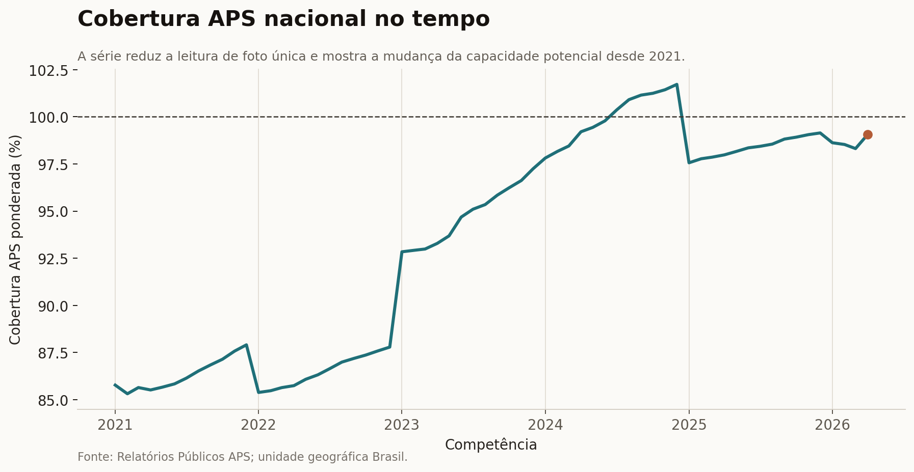
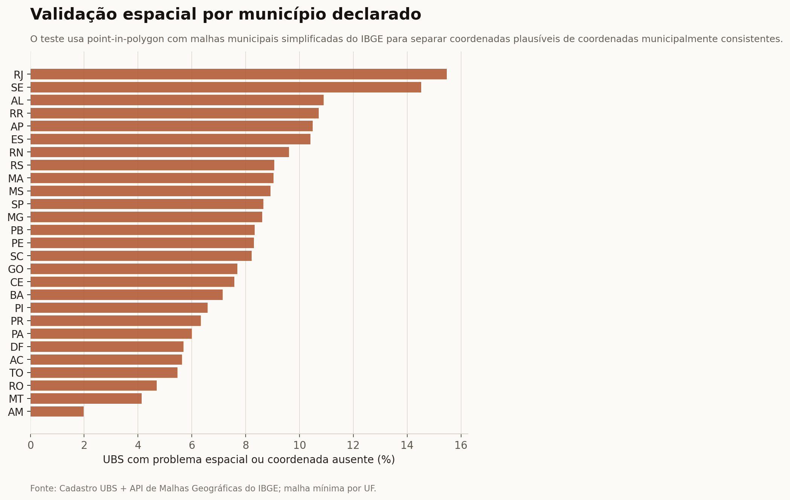
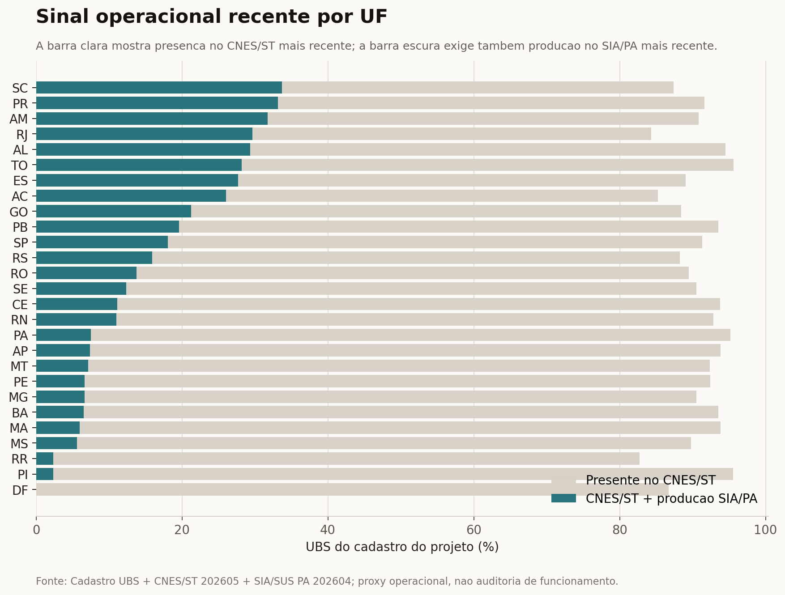

# UBS + IBGE + Cobertura Potencial APS

Projeto de analise territorial em saude publica. A ideia e cruzar quatro camadas que costumam ser lidas separadamente: o cadastro fisico de Unidades Basicas de Saude, o contexto populacional e territorial do IBGE/SIDRA, a cobertura potencial da Atencao Primaria a Saude e a consistencia espacial das coordenadas.

O resultado nao tenta dizer se um territorio esta bem atendido. Essa resposta exigiria producao assistencial, equipes ativas por periodo, demanda, distancia real ate os servicos e qualidade do cuidado. Aqui o objetivo e mais cuidadoso: montar uma base comparavel, mostrar onde a leitura por volume de UBS engana e apontar lugares que merecem investigacao.

## Dashboard

[Abrir dashboard interativo](https://luandarodrigues.github.io/luandarodrigues/dashboards/ubs-healthcare-mapping/)

O dashboard e uma camada estatica em GitHub Pages. Os dados usados nele ficam versionados em `docs/dashboards/ubs-healthcare-mapping/data/`, para evitar diferenca entre o relatorio e os CSVs do projeto.

Para evitar confundir mercado-alvo amplo com piloto operacional, a leitura foi separada em duas visoes: oportunidade nacional de telemedicina e piloto farmacia assistida. Ver: [`TELEMEDICINE_DASHBOARD_VIEWS.md`](TELEMEDICINE_DASHBOARD_VIEWS.md).

## Pergunta

Contar UBS responde onde existem registros de unidades. Nao responde, sozinho, se existe capacidade suficiente de atencao primaria.

> O que muda quando o cadastro de UBS e analisado junto com populacao, territorio, cobertura potencial da APS e qualidade espacial das coordenadas?

## Dados

| Camada | Fonte | Como entra na analise |
|---|---|---|
| Cadastro de UBS | Arquivo publico `Unidades_Basicas_Saude-UBS.csv` | Registros de unidades, CNES, UF, municipio e coordenadas |
| IBGE Localidades | API oficial de municipios do IBGE | Nome oficial do municipio, UF e regiao |
| IBGE Malhas | API oficial de malhas geograficas do IBGE | Poligonos municipais simplificados para validacao espacial |
| SIDRA 4714 | Tabela do IBGE/SIDRA | Populacao residente, area territorial e densidade |
| Cobertura APS | Relatorio publico de Cobertura Potencial APS | Populacao, equipes, capacidade estimada e cobertura potencial |
| CNES/ST | FTP publico DATASUS/CNES | Presenca do estabelecimento no cadastro mensal mais recente |
| SIA/SUS PA | FTP publico DATASUS/SIASUS | Producao ambulatorial registrada por CNES na competencia mais recente |
| Farmacia Popular | Extrato oficial do Ministerio da Saude fornecido ao pipeline | Presenca cadastral de estabelecimentos credenciados, com validacao de coordenadas |

Referencias de origem:

- IBGE Localidades: https://servicodados.ibge.gov.br/api/docs/localidades
- IBGE Malhas: https://servicodados.ibge.gov.br/api/docs/malhas?versao=3
- SIDRA API usada no pipeline: https://apisidra.ibge.gov.br/values/t/4714/n6/all/p/last
- Relatorios Publicos APS: https://relatorioaps.saude.gov.br/cobertura/aps
- FTP DATASUS: ftp://ftp.datasus.gov.br/dissemin/publicos/

## Numeros principais

| Indicador | Valor |
|---|---:|
| Registros de UBS | 47.714 |
| CNES unicos | 47.714 |
| UFs representadas | 27 |
| Municipios no cadastro UBS | 5.483 |
| Registros com coordenadas validas no Brasil | 45.782, ou 95,95% |
| Registros dentro do municipio declarado | 43.717, ou 91,62% |
| Registros fora do poligono municipal declarado | 2.062 |
| Registros presentes no CNES/ST mais recente | 43.578, ou 91,33% |
| Registros com producao SIA/PA em 3 competencias recentes | 11.335, ou 23,76% |
| Registros com CNES/ST e SIA/PA em 3 competencias recentes | 11.333, ou 23,75% |
| Registros com match territorial IBGE/SIDRA | 47.710 |
| Registros sem match territorial | 4 registros em 2 municipios |
| Competencia APS | 04/2026 |
| Municipios no arquivo APS oficial | 5.567 |
| Populacao no arquivo APS | 213,4 milhoes |
| Capacidade estimada APS | 211,4 milhoes |
| Cobertura APS ponderada por populacao | 99,1% |

## Graficos do relatorio

### 1. Distribuicao regional das UBS


Nordeste e Sudeste concentram a maior parte dos registros. Isso e esperado em parte pela distribuicao populacional, mas nao deve ser lido como suficiencia de oferta. A leitura melhora quando o denominador entra.

### 2. UBS por populacao


Quando a contagem passa a ser ajustada por populacao, o ranking muda. Estados com muitos registros absolutos podem ter disponibilidade relativa menor, enquanto estados menores aparecem com mais UBS por 100 mil habitantes.

### 3. Cobertura APS ponderada


A cobertura APS do arquivo tem muitos valores municipais acima de 100%. Por isso o projeto guarda duas leituras:

- cobertura nominal ponderada, que preserva valores acima de 100% como sinal de capacidade informada;
- cobertura capada em 100%, usada quando a pergunta e proporcao da populacao potencialmente coberta.

Essa separacao evita interpretar capacidade nominal excedente como acesso real.

### 4. Sinais para investigacao


O score e uma triagem, nao um ranking de politica publica. Ele combina baixa disponibilidade relativa de UBS, gap positivo de APS e qualidade de coordenadas. O papel dele e indicar onde uma analise mais profunda faria sentido.

### 5. Sensibilidade do score


O score foi testado em quatro cenarios: base, cobertura, territorio e qualidade cadastral. Quando uma UF muda muito de posicao entre cenarios, o resultado deve ser lido com mais cautela. Quando permanece alta em varios cenarios, o sinal e mais estavel.

### 6. Serie nacional da APS



A serie nacional reduz o limite de olhar apenas uma competencia. Ela mostra a cobertura potencial ponderada entre 2021 e 2026, com a competencia mais recente destacada.

### 7. Validacao espacial



A validacao espacial usa malhas municipais simplificadas do IBGE e um teste point-in-polygon. O objetivo e separar coordenadas apenas plausiveis de coordenadas consistentes com o municipio declarado. O resultado deve ser lido como triagem de qualidade cadastral, porque a malha usada e simplificada e nao substitui auditoria local.

### 8. Sinal operacional recente



Esta camada separa tres ideias que antes ficavam misturadas: estar no cadastro original do projeto, aparecer no CNES/ST mais recente e ter producao SIA/SUS PA em uma janela de 3 competencias recentes. O resultado e uma proxy conservadora de atividade registrada. Ausencia de producao SIA/PA nessa janela nao prova unidade fechada: pode refletir atraso, centralizacao de registro, regra local de faturamento ou producao registrada em outro CNES.

### 9. Indice robusto de prioridade


O indice robusto combina cinco dimensoes: UBS por populacao, gap de cobertura APS, sinal operacional recente, qualidade espacial e uma proxy de vulnerabilidade territorial. A proxy de vulnerabilidade usa densidade populacional e dispersao territorial de UBS; ela nao substitui renda, pobreza, saneamento ou outros indicadores sociais. Por isso o indice deve ser lido como triagem territorial para investigacao, nao como ranking oficial de necessidade.

## Metodo

A justificativa bibliografica do metodo esta em [METHODOLOGICAL_REFERENCES.md](METHODOLOGICAL_REFERENCES.md).

1. Ler o cadastro UBS com deteccao de separador e encoding.
2. Padronizar UF, municipio, latitude e longitude.
3. Validar coordenadas com uma checagem ampla de bounding box do Brasil.
4. Validar se o ponto da UBS cai dentro do poligono municipal declarado.
5. Agregar UBS por municipio, UF e regiao.
6. Normalizar a chave municipal: UBS e APS usam codigo IBGE de 6 digitos, enquanto IBGE/SIDRA usam o codigo oficial de 7 digitos.
7. Juntar IBGE Localidades e SIDRA 4714.
8. Calcular UBS por 10 mil habitantes, UBS por 1.000 km2 e validade de coordenadas.
9. Normalizar o arquivo de Cobertura APS.
10. Calcular cobertura nominal, cobertura capada em 100%, gap positivo e excesso nominal.
11. Cruzar CNES/ST e SIA/SUS PA em janela de 3 competencias para criar uma proxy operacional.
12. Rodar indice robusto de prioridade e sensibilidade por cenarios.
13. Gerar CSVs, graficos e dashboard.

## Como reproduzir

```bash
python projects/ubs-healthcare-mapping/scripts/analyze_ubs.py \
  projects/ubs-healthcare-mapping/data/Unidades_Basicas_Saude-UBS.csv \
  projects/ubs-healthcare-mapping/data

python projects/ubs-healthcare-mapping/scripts/enrich_with_ibge.py \
  --input projects/ubs-healthcare-mapping/data/Unidades_Basicas_Saude-UBS.csv \
  --output-dir projects/ubs-healthcare-mapping/data/enriched

python projects/ubs-healthcare-mapping/scripts/fetch_latest_aps_coverage.py
python projects/ubs-healthcare-mapping/scripts/fetch_aps_national_timeseries.py

python projects/ubs-healthcare-mapping/scripts/enrich_with_aps_coverage.py \
  --ubs-territory projects/ubs-healthcare-mapping/data/enriched/municipality_ubs_territory.csv \
  --aps-file projects/ubs-healthcare-mapping/data/cobertura-aps-latest.csv \
  --output-dir projects/ubs-healthcare-mapping/data/enriched

python projects/ubs-healthcare-mapping/scripts/priority_sensitivity_analysis.py
python projects/ubs-healthcare-mapping/scripts/coordinate_quality_audit.py
python projects/ubs-healthcare-mapping/scripts/validate_ubs_municipal_geometry.py
python projects/ubs-healthcare-mapping/scripts/fetch_ubs_operational_status.py
python projects/ubs-healthcare-mapping/scripts/robust_priority_index.py
python projects/ubs-healthcare-mapping/scripts/generate_report_assets.py
python projects/ubs-healthcare-mapping/scripts/build_dashboard_data.py
python projects/ubs-healthcare-mapping/scripts/build_data_lineage.py

# Depois de baixar o extrato oficial do Farmacia Popular:
python projects/ubs-healthcare-mapping/scripts/build_pharmacy_layer.py \
  caminho/para/farmacias.csv \
  --output-dir projects/ubs-healthcare-mapping/data

python projects/ubs-healthcare-mapping/scripts/analyze_pharmacy_access_gap.py

# Copia os artefatos versionados para o dashboard:
python projects/ubs-healthcare-mapping/scripts/build_dashboard_data.py
```

### Camada Farmacia Popular

O importador aceita CSV ou XLSX e reconhece variantes comuns de colunas oficiais em portugues, incluindo CNPJ, CNES, razao social, municipio, codigo IBGE, UF, endereco, latitude e longitude. Ele gera:

- `data/pharmacies.csv`: esquema canonico e indicador de coordenada valida;
- `data/pharmacies_by_uf.csv`: contagem e qualidade geografica por UF;
- `data/pharmacies.geojson`: somente pontos com coordenadas plausiveis no Brasil.

O arquivo oficial de entrada nao e baixado automaticamente porque o endereco e o formato de publicacao podem mudar. A competencia, a URL e a data de download devem ser registradas junto ao arquivo de origem. Credenciamento indica presenca cadastral no programa; nao comprova estoque, horario de funcionamento ou disponibilidade de todos os medicamentos.

O arquivo `data/enriched/municipality_pharmacy_access_gap.csv` usa uma regra municipal explicita. O sinal `consistent_mismatch` exige simultaneamente: UBS presentes no CNES recente por 100 mil habitantes abaixo do primeiro quartil nacional; cobertura potencial APS abaixo de 80%; e Farmacias Populares por 100 mil habitantes na mediana nacional ou acima. Farmacias sao deduplicadas por CNPJ e as juncoes usam codigo IBGE de 6 digitos. O resultado e uma proxy cadastral com nivel de evidencia, nao uma afirmacao sobre tempo real de viagem. Para medir deslocamento serao necessarios grade populacional, rede viaria e tempos de rota.

## Indice preliminar de oportunidade para telemedicina

O projeto inclui uma trilha separada para pre-paper e planejamento territorial agregado. Ela nao substitui o indicador de descompasso e nao afirma demanda individual ou proximidade real.

```bash
python projects/ubs-healthcare-mapping/scripts/fetch_ibge_municipality_universe.py
python projects/ubs-healthcare-mapping/scripts/build_telemedicine_opportunity_index.py
python projects/ubs-healthcare-mapping/scripts/fetch_cnes_workforce_teams.py
python projects/ubs-healthcare-mapping/scripts/fetch_ibge_internet_readiness.py
python projects/ubs-healthcare-mapping/scripts/fetch_anatel_connectivity.py
python projects/ubs-healthcare-mapping/scripts/build_telemedicine_phase1_index.py
python projects/ubs-healthcare-mapping/scripts/build_data_lineage.py
```

O pipeline reconcilia o universo oficial do IBGE, estima populacao potencialmente descoberta, calcula eixos separados de necessidade e capilaridade PFPB, publica tres cenarios de pesos e executa 1.000 simulacoes de sensibilidade. Os arquivos principais sao:

- `data/enriched/telemedicine_pre_paper_analytic.csv`: base municipal selecionada para analise;
- `data/enriched/telemedicine_opportunity_monte_carlo.csv`: incerteza de pontuacao e ranking;
- `data/enriched/telemedicine_ads_geo_shortlist.csv`: shortlist de 100 municipios para validacao operacional e testes geograficos;
- `PREPAPER_TELEMEDICINE_PROTOCOL.md`: protocolo, formulas, hipoteses e limitacoes;
- `TELEMEDICINE_DATA_DICTIONARY.md`: definicoes de campos;
- `ADS_TERRITORIAL_POSITIONING.md`: uso permitido em planejamento de midia agregada.

O termo `pharmacy_launchability_score` significa apenas capilaridade municipal observada. Tempo de viagem, prontidao digital, sala privada, equipe e demanda clinica permanecem explicitamente como `not_measured`.

A extensão `phase1-v1` preserva o índice preliminar e acrescenta escassez de médico FTE, internet domiciliar, cobertura móvel e banda larga fixa. Produção SIA de todos os procedimentos é evidência de auditoria e não entra no score. Novos artefatos:

- `data/enriched/telemedicine_opportunity_phase1.csv`: painel municipal completo da Fase 1;
- `data/enriched/telemedicine_opportunity_phase1_monte_carlo.csv`: incerteza dos pesos e posições;
- `data/enriched/telemedicine_phase1_ads_geo_shortlist.csv`: 100 municípios para desenho de geoexperimento, não targeting individual;
- `data/enriched/telemedicine_opportunity_phase1_metadata.json`: fórmula, pesos, semente e usos permitidos.

Mesmo na Fase 1, `spatial_travel_time_status` permanece `not_measured`: cobertura municipal e densidade de serviços não substituem roteamento em rede viária.

## Fase 2 — triagem espacial geodésica

```bash
python projects/ubs-healthcare-mapping/scripts/fetch_osm_pharmacies.py
python projects/ubs-healthcare-mapping/scripts/fetch_ibge_municipal_seats.py
python projects/ubs-healthcare-mapping/scripts/build_phase2_spatial_access.py
python projects/ubs-healthcare-mapping/scripts/build_telemedicine_phase2_index.py
python projects/ubs-healthcare-mapping/scripts/build_dashboard_data.py
```

A Fase 2 usa sedes municipais oficiais, UBS ativas auditadas e 14.776 farmácias comuns mapeadas no OSM. O sinal conservador exige UBS ≥5 km, farmácia ≤2 km, PFPB presente e necessidade positiva. A shortlist contém seis municípios para investigação de rota e operação. Goiânia continua relevante no índice geral, mas não satisfaz esse sinal espacial.

Os quilômetros publicados são geodésicos, não tempo de viagem. O próximo incremento necessário para elevar a evidência é uma matriz populacional de origens e roteamento em rede viária.

Testes de sanidade:

```bash
python -m unittest discover -s projects/ubs-healthcare-mapping/tests
```

## Arquivos

```text
projects/ubs-healthcare-mapping/
|-- README.md
|-- DATA_ENRICHMENT.md
|-- METHODOLOGICAL_REFERENCES.md
|-- PUBLICATION_AUDIT.md
|-- requirements.txt
|-- assets/
|   |-- 01_ubs_distribution_by_region.png
|   |-- 02_ubs_per_population_extremes.png
|   |-- 03_aps_weighted_coverage_by_uf.png
|   |-- 04_priority_screening_top10.png
|   |-- 05_priority_sensitivity.png
|   |-- 06_aps_national_timeseries.png
|   |-- 07_spatial_validation_by_uf.png
|   |-- 08_operational_status_by_uf.png
|   `-- 09_robust_priority_index.png
|-- data/
|   |-- Unidades_Basicas_Saude-UBS.csv
|   |-- cobertura-aps-latest.csv
|   |-- aps_national_timeseries.csv
|   |-- coordinate_quality_by_uf.csv
|   |-- spatial_validation_by_uf.csv
|   |-- spatial_validation_suspect_ubs.csv
|   |-- spatial_validation_metadata.json
|   |-- ubs_operational_status.csv
|   |-- ubs_operational_status_by_uf.csv
|   |-- ubs_operational_status_metadata.json
|   |-- data_lineage_manifest.csv
|   |-- geodata/
|   `-- enriched/
|       |-- robust_priority_index_uf.csv
|       `-- robust_priority_sensitivity_uf.csv
|-- scripts/
|   |-- analyze_ubs.py
|   |-- analyze_pharmacy_access_gap.py
|   |-- build_dashboard_data.py
|   |-- build_data_lineage.py
|   |-- build_pharmacy_layer.py
|   |-- coordinate_quality_audit.py
|   |-- enrich_with_ibge.py
|   |-- enrich_with_aps_coverage.py
|   |-- fetch_aps_national_timeseries.py
|   |-- fetch_latest_aps_coverage.py
|   |-- fetch_ubs_operational_status.py
|   |-- generate_report_assets.py
|   |-- priority_sensitivity_analysis.py
|   |-- robust_priority_index.py
|   `-- validate_ubs_municipal_geometry.py
`-- tests/
    `-- test_pipeline_sanity.py
```

## Limites e ajustes feitos

| Limite | Como foi reduzido nesta versao | O que ainda falta |
|---|---|---|
| Coordenada valida nao prova municipio correto | foi adicionada validacao point-in-polygon com malhas municipais simplificadas do IBGE; 43.717 registros caem dentro do municipio declarado | refinar casos de fronteira com malha de maior detalhe e auditoria local |
| APS era uma foto unica | foi adicionada serie nacional de 64 competencias entre 2021 e 2026 | criar serie municipal ou por UF |
| UBS e cadastro, nao operacao real | o texto separa presenca fisica, capacidade potencial e acesso real | integrar CNES ativo, equipes por competencia e producao ambulatorial |
| Cadastro nao prova atividade recente | foi criada proxy com CNES/ST mais recente e producao SIA/SUS PA em 3 competencias; 43.578 aparecem no CNES/ST e 11.333 combinam CNES/ST com producao PA recente | ampliar para 6 meses, equipes CNES e outros blocos de producao |
| Prioridade territorial dependia de um score simples | foi criado indice robusto com 5 componentes e 5 cenarios de sensibilidade | incluir vulnerabilidade socioeconomica direta quando a base municipal estiver consolidada |
| Score depende de pesos | foi adicionada sensibilidade com quatro cenarios | calibrar pesos com especialistas ou analise multicriterio formal |
| Agregacao por UF pode esconder heterogeneidade municipal | ha dados municipais enriquecidos e alerta metodologico | publicar mapa municipal e analise espacial local |
| Distancia geodesica nao mede tempo de viagem | foi criada e roteada matriz OD da Fase 3 para os alvos conservadores; 4/6 permanecem fortes por tempo de carro | rerodar OSRM local versionado e, depois, origem ponderada por populacao |
| Roteamento precisava virar decisao operacional | foi criado indice Fase 4 restrito a subamostra roteada e shortlist com 4 alvos primarios | validar farmacias, internet, privacidade e agenda medica no campo |
| Proveniencia dos dados podia ser fraca | foi criado manifesto com linhas, colunas, bytes e SHA-256 dos principais arquivos | adicionar data de download e licenca quando cada fonte trouxer esse metadado explicitamente |
| Dois municipios do cadastro UBS nao fecharam com IBGE/SIDRA | os casos ficam documentados no metadata e saem da sintese por UF | tratar mudancas municipais recentes ou divergencias cadastrais caso a caso |

## Proximos passos

- Revisar os 2.062 registros fora do poligono municipal declarado, separando erro cadastral, ponto em fronteira e unidade regionalizada.
- Expandir o sinal operacional para janela de 3 a 6 meses e comparar SIA/PA com equipes ativas CNES.
- Criar serie temporal APS por UF ou municipio.
- Evoluir a sensibilidade do score para analise de incerteza com intervalos e pesos definidos com especialistas.
- Adicionar mapa municipal para leitura local.
- Rerodar `data/enriched/telemedicine_phase3_routing_od_matrix.csv` em OSRM local versionado e documentar extrato OSM, endpoint, perfil e timestamp.
- Usar `data/enriched/telemedicine_phase4_ads_routed_shortlist.csv` como lista inicial de piloto, com validacao local antes de compra de midia.

## Stack

Python, Pandas, Requests, OpenPyXL, Matplotlib, IBGE APIs, SIDRA, HTML, CSS, JavaScript, GitHub Pages, analise territorial, qualidade de dados e saude publica.
