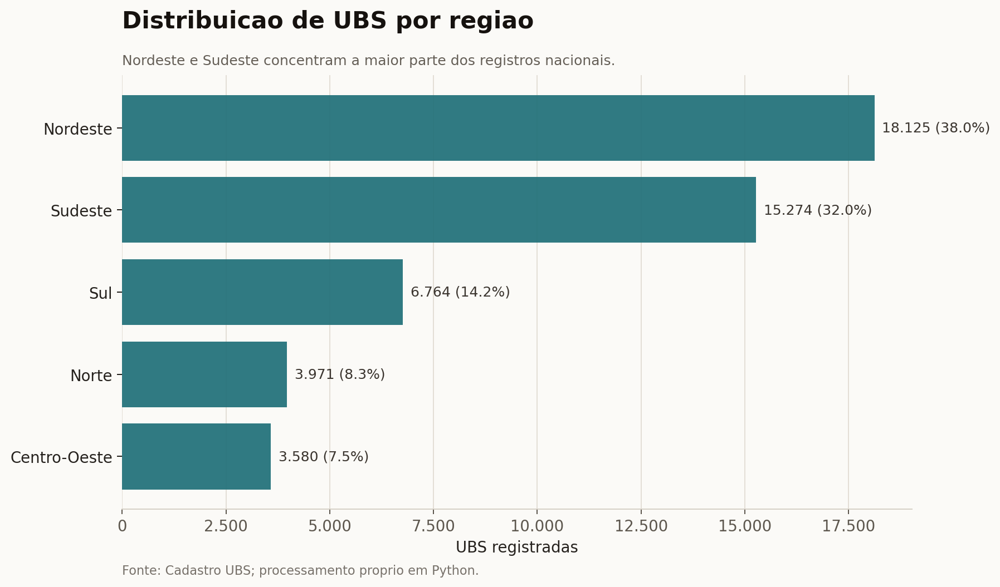
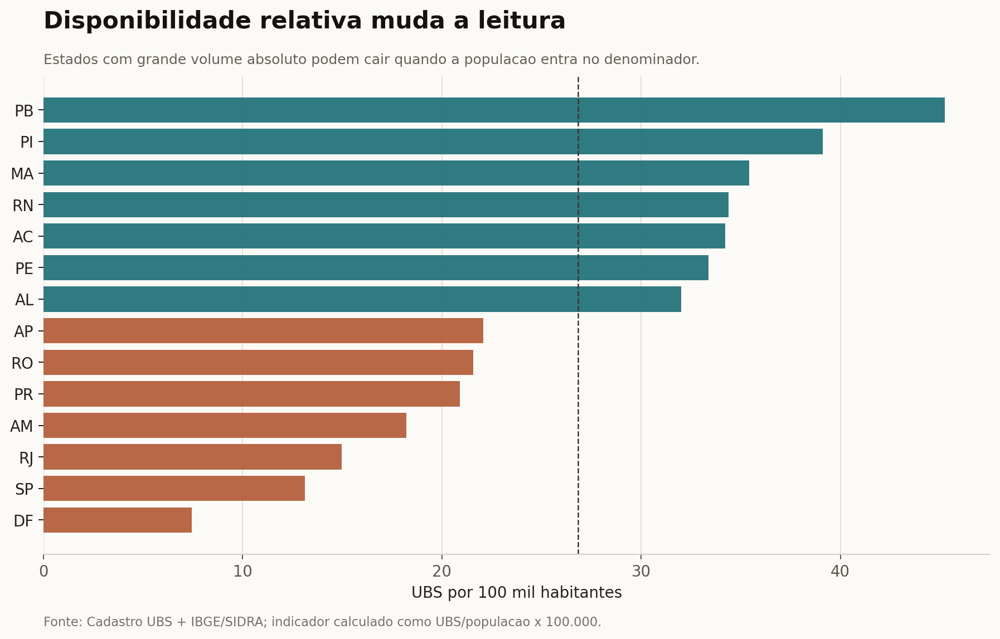
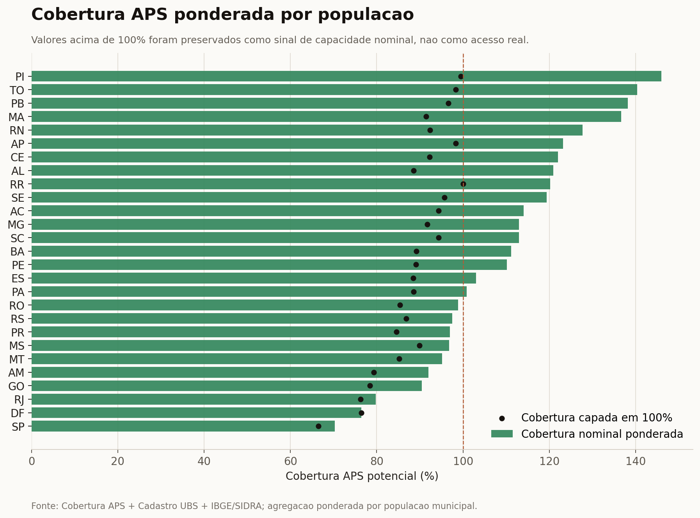
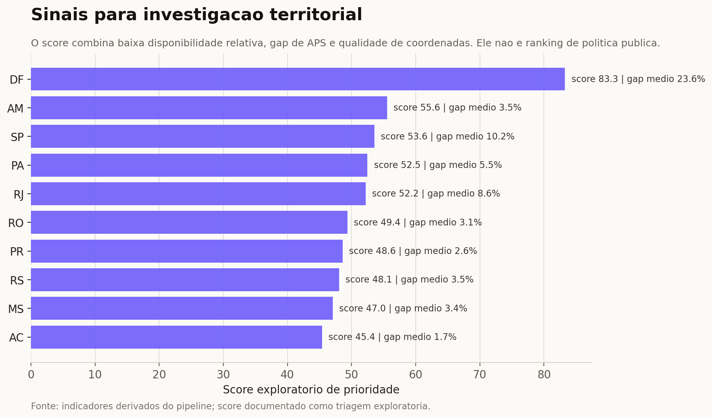
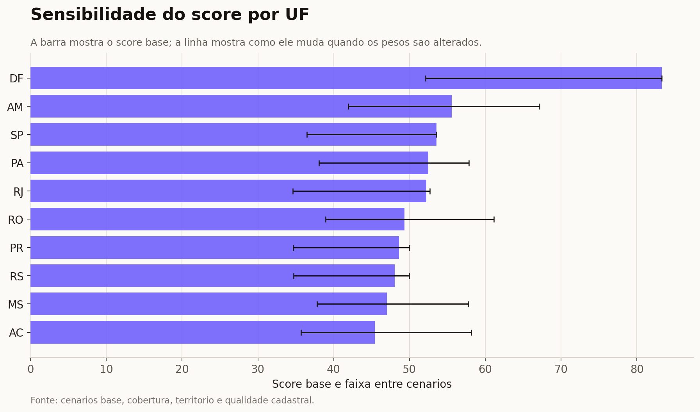

# UBS + IBGE + Cobertura Potencial APS

Projeto de análise territorial em saúde pública. A ideia é cruzar três camadas que costumam ser lidas separadamente: o cadastro físico de Unidades Básicas de Saúde, o contexto populacional e territorial do IBGE/SIDRA, e a cobertura potencial da Atenção Primária à Saúde.

O resultado não tenta dizer se um território está bem atendido. Essa resposta exigiria produção assistencial, equipes ativas por período, demanda, distância real até os serviços e qualidade do cuidado. Aqui o objetivo é mais cuidadoso: montar uma base comparável, mostrar onde a leitura por volume de UBS engana e apontar lugares que merecem investigação.

## Dashboard

[Abrir dashboard interativo](https://luandarodrigues.github.io/luandarodrigues/dashboards/ubs-healthcare-mapping/)

O dashboard é uma camada de apresentação estática em GitHub Pages. Os dados usados nele ficam versionados em `docs/dashboards/ubs-healthcare-mapping/data/`, para evitar diferença entre o relatório e os CSVs do projeto.

## Pergunta

Contar UBS responde onde existem registros de unidades. Não responde, sozinho, se existe capacidade suficiente de atenção primária.

A pergunta deste projeto é:

> O que muda quando o cadastro de UBS é analisado junto com população, território e cobertura potencial da APS?

## Dados

| Camada | Fonte | Como entra na análise |
|---|---|---|
| Cadastro de UBS | Arquivo público `Unidades_Basicas_Saude-UBS.csv` | Registros de unidades, CNES, UF, município e coordenadas |
| IBGE Localidades | API oficial de municípios do IBGE | Nome oficial do município, UF e região |
| SIDRA 4714 | Tabela do IBGE/SIDRA | População residente, área territorial e densidade |
| Cobertura APS | Relatório público de Cobertura Potencial APS | População, equipes, capacidade estimada e cobertura potencial |

Referências de origem:

- IBGE Localidades: https://servicodados.ibge.gov.br/api/docs/localidades
- SIDRA API usada no pipeline: https://apisidra.ibge.gov.br/values/t/4714/n6/all/p/last
- Relatórios Públicos APS: https://relatorioaps.saude.gov.br/cobertura/aps

## Números principais

| Indicador | Valor |
|---|---:|
| Registros de UBS | 47.714 |
| CNES únicos | 47.714 |
| UFs representadas | 27 |
| Municípios no cadastro UBS | 5.483 |
| Registros com coordenadas válidas | 45.782, ou 95,95% |
| Registros com match territorial IBGE/SIDRA | 47.710 |
| Registros sem match territorial | 4 registros em 2 municípios |
| Competência APS | 04/2026 |
| Municípios no arquivo APS oficial | 5.567 |
| População no arquivo APS | 213,4 milhões |
| Capacidade estimada APS | 211,4 milhões |
| Cobertura APS ponderada por população | 99,1% |

## Gráficos do relatório

### 1. Distribuição regional das UBS



Nordeste e Sudeste concentram a maior parte dos registros. Isso é esperado em parte pela distribuição populacional, mas não deve ser lido como suficiência de oferta. A leitura melhora quando o denominador entra.

### 2. UBS por população



Quando a contagem passa a ser ajustada por população, o ranking muda. Estados com muitos registros absolutos podem ter disponibilidade relativa menor, enquanto estados menores aparecem com mais UBS por 100 mil habitantes.

### 3. Cobertura APS ponderada



A cobertura APS do arquivo tem muitos valores municipais acima de 100%. Por isso o projeto guarda duas leituras:

- cobertura nominal ponderada, que preserva valores acima de 100% como sinal de capacidade informada;
- cobertura capada em 100%, usada quando a pergunta é proporção da população potencialmente coberta.

Essa separação evita interpretar capacidade nominal excedente como acesso real.

Os KPIs de APS usam o arquivo oficial completo. A tabela integrada usa a interseção entre APS e o cadastro UBS, porque depende da junção com a camada territorial do projeto.

### 4. Sinais para investigação



O score é uma triagem, não um ranking de política pública. Ele combina baixa disponibilidade relativa de UBS, gap positivo de APS e qualidade de coordenadas. O papel dele é indicar onde uma análise mais profunda faria sentido.

### 5. Sensibilidade do score



O score foi testado em quatro cenários: base, cobertura, território e qualidade cadastral. Quando uma UF muda muito de posição entre cenários, o resultado deve ser lido com mais cautela. Quando permanece alta em vários cenários, o sinal é mais estável.

## Método

A justificativa bibliográfica do método está em [METHODOLOGICAL_REFERENCES.md](METHODOLOGICAL_REFERENCES.md).

1. Ler o cadastro UBS com detecção de separador e encoding.
2. Padronizar UF, município, latitude e longitude.
3. Validar coordenadas com uma checagem ampla de bounding box do Brasil.
4. Agregar UBS por município, UF e região.
5. Normalizar a chave municipal: UBS e APS usam código IBGE de 6 dígitos, enquanto IBGE/SIDRA usam o código oficial de 7 dígitos.
6. Juntar IBGE Localidades e SIDRA 4714.
7. Calcular UBS por 10 mil habitantes, UBS por 1.000 km² e validade de coordenadas.
8. Normalizar o arquivo de Cobertura APS.
9. Calcular cobertura nominal, cobertura capada em 100%, gap positivo e excesso nominal.
10. Rodar análise de sensibilidade do score.
11. Gerar CSVs, gráficos e dashboard.

## Como reproduzir

```bash
python projects/ubs-healthcare-mapping/scripts/analyze_ubs.py \
  projects/ubs-healthcare-mapping/data/Unidades_Basicas_Saude-UBS.csv \
  projects/ubs-healthcare-mapping/data

python projects/ubs-healthcare-mapping/scripts/enrich_with_ibge.py \
  --input projects/ubs-healthcare-mapping/data/Unidades_Basicas_Saude-UBS.csv \
  --output-dir projects/ubs-healthcare-mapping/data/enriched

python projects/ubs-healthcare-mapping/scripts/fetch_latest_aps_coverage.py

python projects/ubs-healthcare-mapping/scripts/enrich_with_aps_coverage.py \
  --ubs-territory projects/ubs-healthcare-mapping/data/enriched/municipality_ubs_territory.csv \
  --aps-file projects/ubs-healthcare-mapping/data/cobertura-aps-latest.csv \
  --output-dir projects/ubs-healthcare-mapping/data/enriched

python projects/ubs-healthcare-mapping/scripts/priority_sensitivity_analysis.py

python projects/ubs-healthcare-mapping/scripts/generate_report_assets.py

python projects/ubs-healthcare-mapping/scripts/build_dashboard_data.py
```

Testes de sanidade:

```bash
python -m unittest discover -s projects/ubs-healthcare-mapping/tests
```

## Arquivos

```text
projects/ubs-healthcare-mapping/
├── README.md
├── DATA_ENRICHMENT.md
├── METHODOLOGICAL_REFERENCES.md
├── PUBLICATION_AUDIT.md
├── requirements.txt
├── assets/
│   ├── 01_ubs_distribution_by_region.png
│   ├── 02_ubs_per_population_extremes.png
│   ├── 03_aps_weighted_coverage_by_uf.png
│   ├── 04_priority_screening_top10.png
│   └── 05_priority_sensitivity.png
├── data/
│   ├── Unidades_Basicas_Saude-UBS.csv
│   ├── cobertura-aps-geral.xlsx
│   ├── cobertura-aps-latest.csv
│   ├── aps_api_metadata.json
│   ├── data_quality_summary.csv
│   ├── region_distribution.csv
│   ├── state_distribution.csv
│   └── enriched/
├── scripts/
│   ├── analyze_ubs.py
│   ├── build_dashboard_data.py
│   ├── enrich_with_ibge.py
│   ├── enrich_with_aps_coverage.py
│   ├── fetch_latest_aps_coverage.py
│   ├── generate_report_assets.py
│   └── priority_sensitivity_analysis.py
└── tests/
    └── test_pipeline_sanity.py
```

## Fragilidades conhecidas

- Coordenada válida significa apenas latitude e longitude dentro de uma faixa plausível para o Brasil. Não garante que o ponto esteja no município correto.
- O cadastro UBS mostra presença registrada, não unidade ativa, produção, equipe disponível ou horário de funcionamento.
- A Cobertura APS usada está na competência 04/2026, a mais recente retornada pelo endpoint público no momento desta execução. Ainda assim, decisões operacionais exigem checagem da fonte oficial no dia da análise.
- Valores de cobertura APS acima de 100% foram mantidos como sinal nominal de capacidade. Para falar de população coberta, o projeto também calcula uma versão capada em 100%.
- O score de prioridade é exploratório. Ele não substitui avaliação local, análise espacial fina ou validação com gestores e bases assistenciais.
- Dois municípios do cadastro UBS não fecharam com a camada territorial do IBGE/SIDRA nesta versão. Eles ficam documentados no metadata e não entram na síntese por UF.

## Próximos passos

- Comparar a série temporal da APS, em vez de olhar apenas a competência mais recente.
- Validar coordenadas por distância ao centróide municipal ou polígono oficial.
- Integrar produção ambulatorial, equipes ativas e indicadores socioeconômicos.
- Evoluir a sensibilidade do score para análise de incerteza com intervalos e pesos definidos com especialistas.
- Adicionar mapa com polígonos municipais e leitura regional.

## Stack

Python, Pandas, Requests, OpenPyXL, Matplotlib, IBGE APIs, SIDRA, HTML, CSS, JavaScript, GitHub Pages, análise territorial, qualidade de dados e saúde pública.
