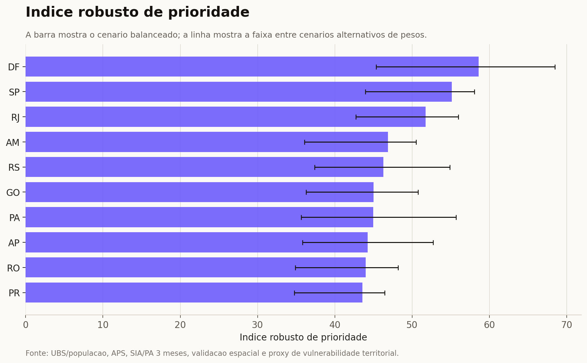

# Atlas territorial de acesso à APS e oportunidade para telemedicina

Este projeto cruza UBS, população, território, cobertura potencial da Atenção Primária à Saúde, Farmácia Popular, farmácias mapeadas, conectividade e sinais operacionais recentes para responder uma pergunta prática:

> Onde a telemedicina pode ampliar acesso sem confundir oportunidade territorial com prova de acesso real?

O resultado principal é um dashboard municipal e uma matriz de decisão. A leitura nacional aponta municípios promissores para telemedicina; a leitura de piloto farmácia assistida fica separada e conservadora.

## Ver o projeto

- [Dashboard interativo](https://luandarodrigues.github.io/luandarodrigues/dashboards/ubs-healthcare-mapping/)
- [Matriz de decisão municipal](TELEMEDICINE_DECISION_MATRIX.md)
- [Protocolo pré-paper](PREPAPER_TELEMEDICINE_PROTOCOL.md)
- [Dicionário de dados](TELEMEDICINE_DATA_DICTIONARY.md)
- [Auditoria de evolução](PROJECT_IMPROVEMENT_AUDIT.md)
- [Referências metodológicas](METHODOLOGICAL_REFERENCES.md)
- [Dados publicados no dashboard](../../docs/dashboards/ubs-healthcare-mapping/data/)

## O que já existe

| Resultado | Valor atual |
| --- | ---: |
| Geometrias municipais no mapa | 5.567 |
| Municípios com score nacional de telemedicina | 4.988 |
| Top nacional para triagem inicial | 100 |
| Oportunidades regionais adicionais | 395 |
| Pilotos farmácia assistida roteados | 4 |
| Registros de UBS analisados | 47.714 |
| UBS com coordenadas válidas no Brasil | 45.782 |
| UBS dentro do município declarado | 43.717 |
| UBS presentes no CNES/ST recente | 43.578 |
| UBS com produção SIA/SUS PA em 3 competências recentes | 11.333 |

Esses números são triagem territorial. Eles não provam demanda clínica, qualidade de cuidado, disponibilidade de agenda, privacidade local ou acesso individual.

## Duas leituras, dois produtos

O projeto separa duas decisões que antes pareciam uma só.

### 1. Índice Nacional de Oportunidade para Telemedicina

Usado para comparar país, estados e municípios. Combina:

- necessidade assistencial;
- barreira espacial;
- prontidão digital;
- viabilidade operacional;
- sensibilidade a pesos.

Exemplo: Goiânia aparece como rank nacional 1 e classe `national_priority_high_readiness`. Isso significa oportunidade territorial para telemedicina, não piloto farmácia assistida.

### 2. Piloto Farmácia Assistida

Usado para testar um modelo específico: difícil chegar à UBS, mas fácil chegar à farmácia. A Fase 4 só considera municípios roteados e exige UBS com tempo de carro alto e farmácia próxima.

Por isso existem apenas 4 alvos roteados nesta fotografia. Esse número pequeno não é falha do índice nacional; é uma regra operacional conservadora.

Leia mais em [TELEMEDICINE_DASHBOARD_VIEWS.md](TELEMEDICINE_DASHBOARD_VIEWS.md).

## Matriz de decisão

A matriz transforma ranking em classe operacional. Ela responde: “que tipo de decisão este município permite?”.

Arquivo principal: `data/enriched/telemedicine_decision_matrix.csv`.

| Classe | Municípios | Uso recomendado |
| --- | ---: | --- |
| `national_priority_high_readiness` | 100 | Teste de mídia agregado por município/UF |
| `regional_scale_opportunity` | 395 | Experimento regional ou lista ampliada |
| `pharmacy_assisted_pilot` | 4 | Piloto conservador com parceiro local |
| `pharmacy_assisted_geodesic_candidate` | 2 | Roteirizar e validar farmácia parceira |
| `high_need_digital_inclusion_first` | 2 | Inclusão digital antes de campanha simples |
| `monitor_or_low_priority` | 4.485 | Monitorar atualização de dados |
| `insufficient_evidence` | 583 | Corrigir ou complementar dados |

Cada linha traz classe, tier de ads, próxima ação recomendada, principal driver e grau de evidência. O uso em mídia deve permanecer agregado por geografia, nunca por inferência individual.

## Dados usados

| Camada | Fonte | Papel na análise |
| --- | --- | --- |
| UBS | Cadastro público `Unidades_Basicas_Saude-UBS.csv` | Presença física, CNES, município e coordenadas |
| IBGE Localidades | API oficial do IBGE | Nome oficial, UF e região |
| IBGE Malhas | API de malhas municipais | Validação espacial das coordenadas |
| SIDRA 4714 | IBGE/SIDRA | População, área e densidade |
| Cobertura APS | Relatórios públicos APS | Cobertura potencial e população potencialmente descoberta |
| CNES/ST | FTP DATASUS/CNES | Presença recente do estabelecimento |
| SIA/SUS PA | FTP DATASUS/SIASUS | Proxy de produção ambulatorial recente |
| Farmácia Popular | Extrato oficial fornecido ao pipeline | Presença cadastral municipal de PFPB |
| Farmácias comuns | OpenStreetMap `amenity=pharmacy` | Proximidade espacial exploratória |
| Internet e conectividade | IBGE/Anatel | Prontidão digital municipal |

Referências de origem:

- IBGE Localidades: https://servicodados.ibge.gov.br/api/docs/localidades
- IBGE Malhas: https://servicodados.ibge.gov.br/api/docs/malhas?versao=3
- SIDRA API: https://apisidra.ibge.gov.br/values/t/4714/n6/all/p/last
- Relatórios Públicos APS: https://relatorioaps.saude.gov.br/cobertura/aps
- FTP DATASUS: ftp://ftp.datasus.gov.br/dissemin/publicos/

## Método por fases

| Fase | Entrega | Evidência que adiciona |
| --- | --- | --- |
| Base UBS + IBGE + APS | Agregação municipal, UF e região | Denominadores populacionais e territoriais |
| Qualidade espacial | Point-in-polygon com malhas IBGE | Se a coordenada da UBS é coerente com o município declarado |
| Sinal operacional | CNES/ST recente + SIA/SUS PA | Proxy conservadora de atividade registrada |
| Índice robusto APS | Score e sensibilidade por cenário | Triagem territorial para investigação |
| Telemedicina preliminar | Necessidade + capilaridade PFPB | Hipótese nacional para pré-paper e ads |
| Fase 1 | Médico FTE, internet, Anatel e auditoria SIA | Prontidão digital e escassez assistencial |
| Fase 2 | Sede municipal, UBS ativa, OSM farmácias | Distância geodésica; ainda não é tempo de viagem |
| Fase 3 | Matriz origem-destino | Preparação para roteamento |
| Fase 4 | OSRM público em subamostra | Validação roteada exploratória do piloto farmácia |
| Matriz de decisão | Classes interpretáveis | Uso operacional e acadêmico menos dependente de ranking |

O método completo está distribuído em documentos específicos:

- [DATA_ENRICHMENT.md](DATA_ENRICHMENT.md)
- [PHARMACY_DATA.md](PHARMACY_DATA.md)
- [PHASE1_DATA_ACQUISITION.md](PHASE1_DATA_ACQUISITION.md)
- [PHASE2_SPATIAL_ACCESS.md](PHASE2_SPATIAL_ACCESS.md)
- [PHASE3_TRAVEL_TIME_PLAN.md](PHASE3_TRAVEL_TIME_PLAN.md)
- [PHASE4_ROUTED_VALIDATION.md](PHASE4_ROUTED_VALIDATION.md)
- [PHASE4_OSRM_LOCAL_REPRODUCIBILITY.md](PHASE4_OSRM_LOCAL_REPRODUCIBILITY.md)

## Gráficos do relatório

Os gráficos originais continuam versionados em `assets/`:

1. distribuição regional das UBS;
2. UBS por população;
3. cobertura APS ponderada;
4. sinais para investigação;
5. sensibilidade do score;
6. série nacional da APS;
7. validação espacial por UF;
8. sinal operacional recente;
9. índice robusto de prioridade.

Exemplo:



## Como reproduzir

Instale as dependências Python:

```bash
pip install -r projects/ubs-healthcare-mapping/requirements.txt
```

Rode a base territorial e APS:

```bash
python projects/ubs-healthcare-mapping/scripts/analyze_ubs.py ^
  projects/ubs-healthcare-mapping/data/Unidades_Basicas_Saude-UBS.csv ^
  projects/ubs-healthcare-mapping/data

python projects/ubs-healthcare-mapping/scripts/enrich_with_ibge.py ^
  --input projects/ubs-healthcare-mapping/data/Unidades_Basicas_Saude-UBS.csv ^
  --output-dir projects/ubs-healthcare-mapping/data/enriched

python projects/ubs-healthcare-mapping/scripts/fetch_latest_aps_coverage.py
python projects/ubs-healthcare-mapping/scripts/enrich_with_aps_coverage.py
python projects/ubs-healthcare-mapping/scripts/fetch_ubs_operational_status.py
python projects/ubs-healthcare-mapping/scripts/robust_priority_index.py
```

Rode a trilha de telemedicina:

```bash
python projects/ubs-healthcare-mapping/scripts/fetch_ibge_municipality_universe.py
python projects/ubs-healthcare-mapping/scripts/build_telemedicine_opportunity_index.py
python projects/ubs-healthcare-mapping/scripts/fetch_cnes_workforce_teams.py
python projects/ubs-healthcare-mapping/scripts/fetch_ibge_internet_readiness.py
python projects/ubs-healthcare-mapping/scripts/fetch_anatel_connectivity.py
python projects/ubs-healthcare-mapping/scripts/build_telemedicine_phase1_index.py
python projects/ubs-healthcare-mapping/scripts/fetch_osm_pharmacies.py
python projects/ubs-healthcare-mapping/scripts/fetch_ibge_municipal_seats.py
python projects/ubs-healthcare-mapping/scripts/build_phase2_spatial_access.py
python projects/ubs-healthcare-mapping/scripts/build_telemedicine_phase2_index.py
python projects/ubs-healthcare-mapping/scripts/build_phase3_routing_od_matrix.py
python projects/ubs-healthcare-mapping/scripts/build_phase3_routing_summary.py
python projects/ubs-healthcare-mapping/scripts/build_telemedicine_phase4_index.py
python projects/ubs-healthcare-mapping/scripts/build_telemedicine_decision_matrix.py
```

Atualize os artefatos publicados:

```bash
python projects/ubs-healthcare-mapping/scripts/build_dashboard_data.py
python projects/ubs-healthcare-mapping/scripts/build_data_lineage.py
python projects/ubs-healthcare-mapping/scripts/audit_telemedicine_outputs.py
```

> Observação: as rotas da Fase 4 usam OSRM público como proxy exploratória. Para publicação acadêmica, rerode com OSRM local e extrato OSM versionado.

## Testes e auditoria

```bash
python -m pytest projects/ubs-healthcare-mapping/tests
npm run build
npm audit --omit=dev --audit-level=high
```

O auditor principal:

```bash
python projects/ubs-healthcare-mapping/scripts/audit_telemedicine_outputs.py
```

Ele verifica se:

- o GeoJSON do dashboard carrega os campos nacionais e de decisão;
- a visão nacional e a Fase 4 continuam separadas;
- Goiânia permanece oportunidade nacional, não piloto farmácia;
- a matriz de decisão preserva os 4 pilotos Fase 4.

## Limites de interpretação

- Cadastro de UBS não prova acesso real.
- Cobertura potencial APS não substitui produção assistencial nem demanda observada.
- Distância geodésica não é tempo de viagem.
- OSRM público não é reprodutibilidade acadêmica forte.
- Farmácia Popular indica credenciamento, não estoque, sala privada ou disponibilidade operacional.
- OSM farmácias é camada geográfica exploratória, com completude heterogênea.
- Ads devem ser avaliados por geografia agregada, não por segmentação individual de pacientes.

## Evolução recomendada

### 1. Revisão de escopo acadêmica

Criar um protocolo reproduzível com strings de busca, critérios de inclusão, tabela de evidências e vínculo entre literatura e variáveis do índice.

Produto esperado: `SCOPING_REVIEW_TELEMEDICINE_ACCESS.md`.

### 2. Ranking estadual agregado

Gerar resumo por UF com score médio ponderado, contagem de Top 100, contagem de classes da matriz e recomendação de experimento.

Produto esperado: CSV estadual, cards no dashboard e camada “Top estados”.

### 3. Acesso espacial avançado

Substituir a origem municipal simples por origem ponderada por população e avançar para OSRM local. Depois disso, avaliar E2SFCA ou modelo gravitacional.

Produto esperado: método mais publicável para acesso espacial em saúde.

## Stack

Python, Pandas, Requests, OpenPyXL, Matplotlib, PyShp, IBGE APIs, SIDRA, DATASUS, OpenStreetMap, OSRM, HTML, CSS, JavaScript, Leaflet, Astro e GitHub Pages.
